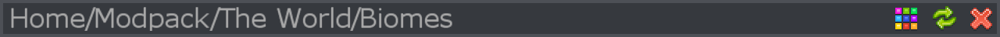
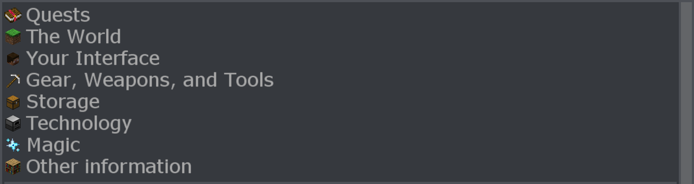

FTB Academy is a modpack dedicated to teaching new players how to play modded Minecraft. We will go over all the important concepts and the most popular mods, so you can use that knowledge to play more complex modpacks.

If you are playing with somebody else, you should create and join a team. This is done by clicking the My Team button at the top left of your inventory.

At the very top of the Guide menu, you can see the directory of the page you're on. You can click on the name of the previous pages to go back to that page. You can also hit backspace to go back one page.

You can change the theme, refresh the guide (which is only really useful for modpack makers), and close the guide using the buttons at the top right. You can also close the guide by hitting E or Escape.

Directly under that, you can see the available pages you can go to. Click on the name of the page to open it.

Some images can be hovered over to see extra text.

