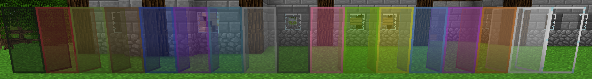

Tinkers' Construct also adds a bunch of other fun things that aren't related to tools or weapons. 

Slime Boots will make you bounce after landing from a fall, negating all fall damage. You can sneak to make it not work.

Holding right click on the Slimesling and aiming at a block then releasing will send you flying in the opposite direction. Highly recommended to wear Slime Boots before using.

The Stone Torch and Ladder works like a regular Torch and Ladder, but can be made using only things you can find while mining!

The Glowball is a thrown projectile that places a light source where it lands.

The EFLN is a thrown projectile that explodes where it lands, breaking blocks but not items. Be very cautious of where you use these, they are very destructive.

Punji Sticks are a placed block that will quickly damage mobs that touch them, as well as applying Slowness II.

There are a bunch of new Item Frames that work exactly the same as regular ones, but just look nice.

Right click the Piggybackpack on a mob to equip it, placing the mob on your head. Unequip the Piggybackpack to put down the mob.

The Drying Rack dries certain items, turning them into other items. This is mostly used to turn raw foods into jerky. You can also dry certain cooked foods into Leather.

Slime Channels work like conveyor belts; they push entities like items and mobs in the direction they flow. This includes up, down, and along walls!
Slime Channels don't block mobs from spawning, so you can use them in mob grinders to push them the moment they spawn.

Clear Glass is exactly what the name implies, it's Glass with a clearer texture. Clear Glass blocks that are touching each other will lose the border connecting them, so you can have big panes of glass without criss crossing white lines!

There's a ton more decorative blocks in Tinkers' Construct! Search JEI for "@Tinkers'Construct" to see the full list of everything added by the mod.
