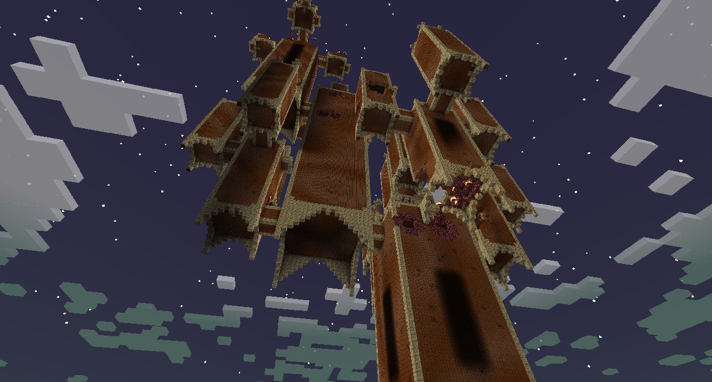
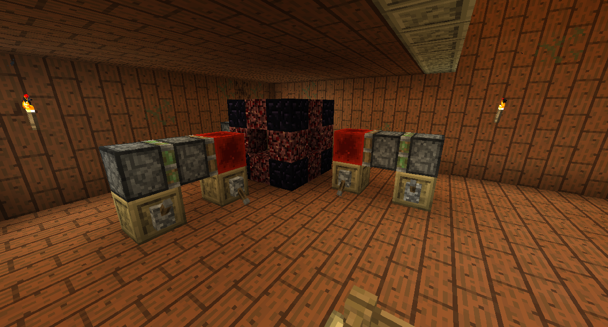

#Dark Forest bosses

###Knight Phantoms

The Knight Phantoms are armored ghosts that can be found at the bottom of Goblin Knight Strongholds, which spawn in Dark Forests. You will have to place any Trophy on the Trophy Pedestal to enter the Stronghold.

If you have not killed and looted the Lich, the Dark Forest will have dark tendrils that will give you Blindness.

The Goblin Knight Stronghold is sprawling, full of loot and enemies. You will eventually find a crypt with the six Phantom Knights. They are not immune to any damage, so you can kill them any way you like.
Once they are all dead, a loot chest will spawn in the middle of the room. Defeating a Knight Phantom will also allow you to enter the Dark Tower at the center of the Dark Forest.

###Ur-Ghast

The Ur-Ghast is a giant Ghast at the top of the Dark Tower.

If you have not killed the Knight Phantoms, the Dark Forest Center will have an impassable blizzard that gives extreme slowness.

The Dark Tower is full of enemies and puzzles. Reappearing Blocks will disappear for a couple seconds once right clicked, allowing you to walk through them.

Some puzzles may involve Anti-Builders, which do not allow you to place or break blocks in their area. Broken blocks will reappear quickly, but you have a small window to walk through. Make your way to the Anti-Builder and break it to complete this puzzle.

You will eventually reach a locked doorway. To pass it, go through the other connected pathways and find the 4 Tower Keys. You may not be able to reach certain areas so you will have to build a walkway.

Flip the levers for a fun surprise!

At the very top of the Dark tower you will find the Ur-Ghast. It has three attacks: It can shoot fireballs, make it rain Ghast Tears, and summon Ghastlings. Ghastlings will spawn around Ghast Traps, and killing them near the Traps and then giving it a Redstone signal from the nearby Pressure Plate will trap the Ur-Ghast if it is above the Trap, dealing critical damage. Used ranged weapons to kill the Ur-Ghast.
Killing the Ur-Ghast will spawn a loot chest in the center of the arena. It will contain an Ur-Ghast trophy, Carminite, and Fiery Tears, which is one of the requirements to enter the Highlands.