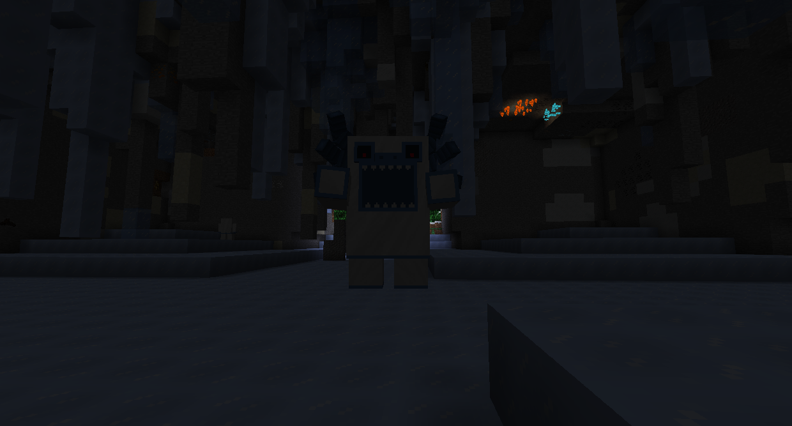

#Ice bosses

###Alpha Yeti

The Alpha Yeti is a large furry monster that can be found in the Yeti Lair, which spawns in Snowy Forests.

If you have not killed and looted the Lich, the Snowy Forest will have an impassable blizzard that gives extreme slowness.

You can find the Alpha Yeti at the center of Yeti Lairs. The Alpha Yeti will begin by thowing huge blocks of ice at the player, freezing everything it lands near. During this stage, it will block all ranged hits. If the player gets a close-range hit in it will enter the next stage, jumping up and down causing ice to fall from the ceiling. After 20 seconds, it will return to the first phase.

After the Alpha Yeti is defeated, it will drop Ice Bombs (which allow you to throw Ice like the Alpha Yeti), Arctic Fur, and Alpha Yeti Fur, which is required to be able to climb the Glacier.

###Snow Queen

The Snow Queen is at the top of the Aurora Palace, on top of the Glacier.

If you have not killed and looted the Alpha Yeti, the Glacier will have an impassable blizzard that gives extreme slowness.

The Aurora Palace has various ice-themed enemies to defeat. The Snow Queen is at the top. She rides a flying cloud of ice, which blocks damage from going through.
The Snow Queen can spawn Ice Crystal mobs, slam into the ground, and slide along the ground shooting ice magic. Use the last two moves as opportunities to deal damage.

Defeating the Snow Queen will give a Tri-bow (which shoots 3 arrows) or a Seeker Bow (whose arrows home in on enemies), as well as a Snow Queen Trophy. Defeating the Snow Queen is also one of the requirements to enter the Highlands.