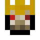

#Starter bosses

###Naga

The Naga is a giant snake that can be found in the Naga Courtyard, which spawns in most forest biomes.
It will chase you around and run into you to cause damage. You can hurt it by hitting it anywhere. As it loses health, it will get shorter. There is no special strategy needed, just hit it until it dies.

The Naga will drop Naga Scales and a Naga Trophy. Picking these up will allow you to access the Lich Tower.

###Lich

The Lich is a skeleton king that can be found in the Lich Tower, which spawns in most forest biomes.

If you have not killed and looted the Naga, the tower will be protected by magic. Mobs will not be able to take damage, and blocks will not be able to be broken.

You can find the Lich at the top of the tower.

The Lich battle has three stages:
During the first phase, the Lich will resist all damage and have 2 minions that attack you. Blue projectiles can be reflected at the Lich to break its shields, and orange projectiles explode.
Once all of its shields are down, the Lich will begin to spawn Zombies to attack you.
Kill all the Zombies and the Lich will begin to attack you directly with a Golden Sword. It can take damage now.

After you kill and loot the Lich, you will be able to access the Twilight Swamp, Dark Forest, and Snowy Forest biomes.

When defeated, the Lich will drop one of 4 Scepters.

The Scepter of Twilight will allow you to shoot out the same blue projectiles that the Lich used in the first phase. Each projectile does 3 hearts of damage. The Scepter can be used 99 times before needing to be recharged with an Ender Pearl.

The Scepter of Life Draining will drain the health of whatever mob is being targeted and give that health to the player using it. It can be used 99 times before having to be recharged with a Fermented Spider Eye.

The Zombie Scepter will spawn a Loyal Zombie, similar to the ones spawned by Lich. After a while, Loyal Zombies will begin to burn until they die. It can be used 9 times before before having to be recharged with Rotten Flesh and a Potion of Strength II. 

The Scepter of Fortification will summon shields around the player. These shields will block all physical damage, but will break afterwards. It can be used 9 times before having to be recharged with a Golden Apple.