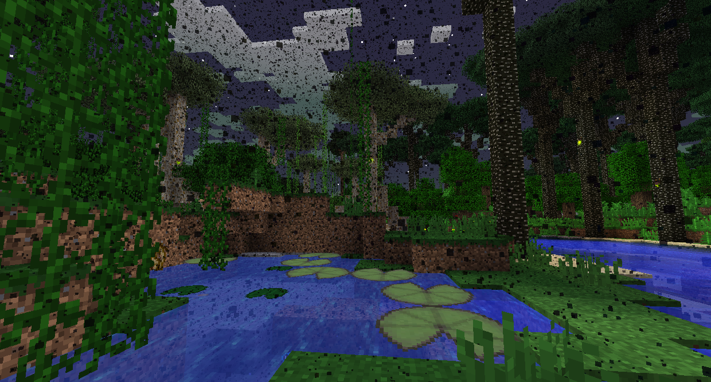

#Swamp bosses

###Minoshroom

The Minoshroom is a Mooshroom minotaur that can be found at the bottom of Labyrinths, which spawn in Twilight Swamps.

If you have not killed and looted the Lich, the Twilight Forest will be full of mosquitos that will attack you and give you Hunger.

Inside the Labyrinth, you can find Minotaurs, Maze Slimes, and Fire and Slime Beetles. Minotaurs have a chance of dropping a Maze Map Focus, which can be crafted into a Maze Map which makes navigating the Labyrinth much easier. They can also make Uncrafting Tables, which allow you to uncraft an item back into its base ingredients.
The Labyrinth is made of Mazestone, which is very slow to mine. There are also traps and loot galore, so be sure to grab what you can carry.

At the bottom of the Labyrinth you can find the Minoshroom. It has a very large amount of health and does a fair amount of damage, so be prepared for a fight. There are no special tactics involved, just keep hitting it.

Killing the Minoshroom will net you a Minoshroom Trophy and some Meef Stroganoff, as well as the treasures in the chests. Eat the Meef Stroganoff to be able to enter the Fiery Swamp at the center of the Twilight Swamp.

###Hydra

The Hydra is a giant multi-headed dragon that breathes fire and spawns in the Hydra Lair, which is at the center of Fire Swamps.

If you have not eaten Meef Stroganoff, the Fire Swamp will be too hot to enter, lighting you on fire if you try.

The Hydra will attack by blowing fire at you, or by shooting explosive bombs. It can only take damage by being shot in its open mouth, so try to tempt it to breath fire at you.

Once defeated, the Hydra will drop Hydra Chops, a Hydra Trophy, and Firey Blood, which is one thing needed to gain access to the Highlands.