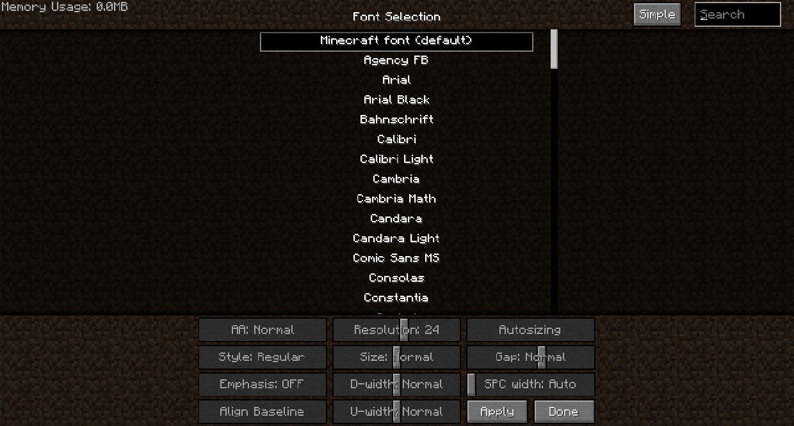

# Text Font

FTB Academy (and most other FTB modpacks) includes the mod Smooth Font, which helps make the font look better. It also changes the default font from the blocky text to something smoother (by default, Verdana).

You can hit the Home key to open the Smooth Font settings menu, where you can select any other font to use, including the regular vanilla blocky font.

