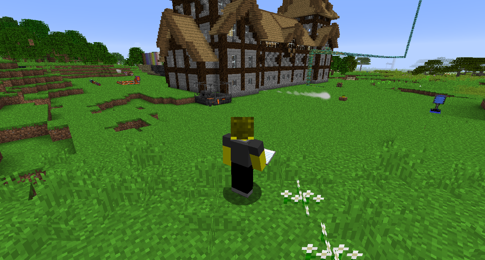

#Gravestones

The mod Tomb Many Graves makes it so that when you die, a Player Grave is placed in the world at the location you died. You can return to it and sneak while standing on it to return all the items you had in your inventory to their original places.

When you respawn, you will have a Death Inventory List that will tell you everything you had in your inventory when you died, as well as where your grave is. When you get nearby, holding the Death Inventory List will point you in the direction of your grave.

Journeymap creates a deathpoint at the location you died, so you can easily find it. You can see it in the minimap and world map, as well as looking like a regular waypoint in the world.