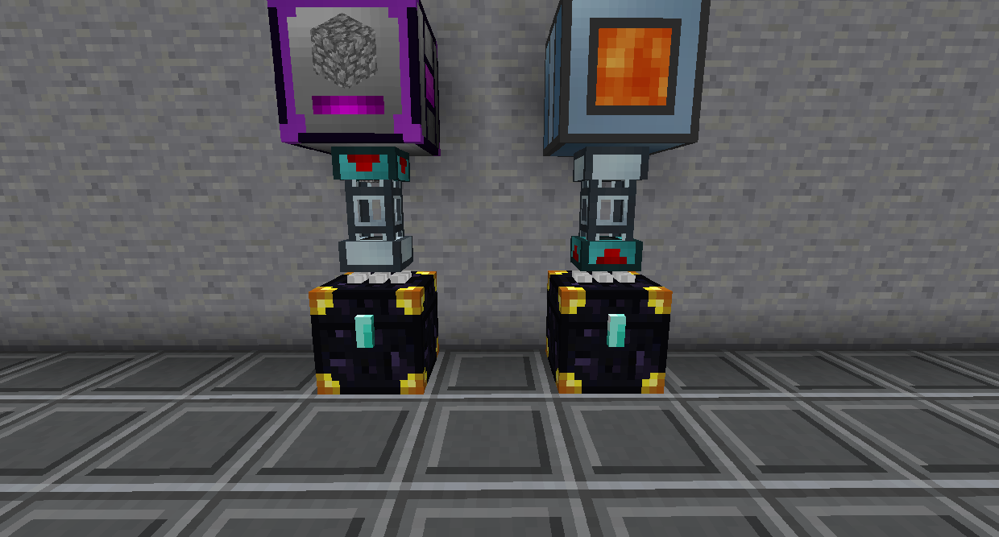

# Other

Simply Backpacks adds 4 tiers of Backpack. You can set a keybind to open it from anywhere in your inventory, including Bauble slots.

You can set another keybind that makes it so that when specific items are picked up, they are automatically inserted into the backpack. Sneak right click on the Backpack to set its whitelist/blacklist.

The Small Storage Crate has 9*13 slots available. The Medium Storage Crate has 2 pages of this, and the Large Storage Crate has 3. Click the arrows on either side of the storage to move between pages.

If you have a Storage Crate Keeper in a Storage Crate, it will retain its contents when broken. The Keeper is destroyed in doing this.

Ender Chests of the same color combination share inventories. You can change the color combination by clicking on the white parts on the top with dyes. Items can be inserted into one and taken out of the other.

You can use a Diamond on the latch of an Ender Chest to set it to private. A private Ender Chest will only connect to other private Ender Chests of the same color combination placed by the same player.

The Ender Pouch can be bound to an Ender Chest by sneak right clicking on it. When the Ender Pouch is opened, it will open the inventory of the bound Ender Chest.

The Strongbox has multiple tiers, higher tiers storing more items. Upgrade the tier with Upgrade or Conversion Kits. You can also enchant it with Holding to increase its storage. The first tier has 18 slots, and the highest tier has 90.
Items remain in the Strongbox when broken. You can break it instantly by sneak right clicking a Crescent Hammer on it.

The Satchel has multiple tiers, higher tiers storing more items. Upgrade the tier through crafting (hit U over the item to see its recipes). You can also enchant it with Holding to increase its storage. The first tier has 9 slots, and the highest tier has 45.
You can sneak right click the Satchel to open a Filter. Items will enter the Satchel instead of your inventory according to the filter if Auto-Collect is enabled. Hover over the Satchel in your inventory and hold Shift to see the keybind to enable Auto-Collect.

The Satchel (Void) works like the Satchel, except it instantly deletes any item that enters it. This can be useful if you set it so Cobblestone or other trash blocks are auto-collected and destroyed.

The Black Hole Unit can store up to 2,147,483,647 of a single item.

The Black Hole Label can be placed on Black Hole Units to make it function like a Storage Drawer. Punch it to extract items, right click to insert.

The Black Hole Controller v2.0 can store up to 12 Black Hole Units/Tanks, which can interacted with via pipes or other automation as if they were placed in the world.
