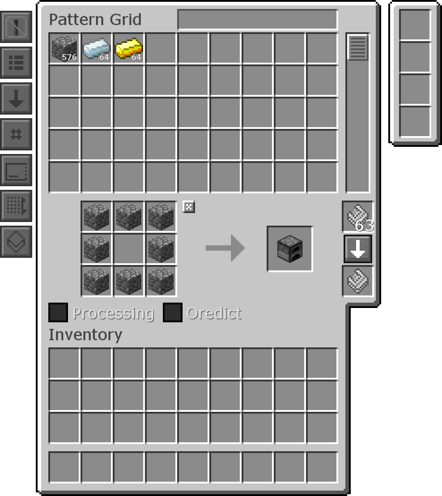
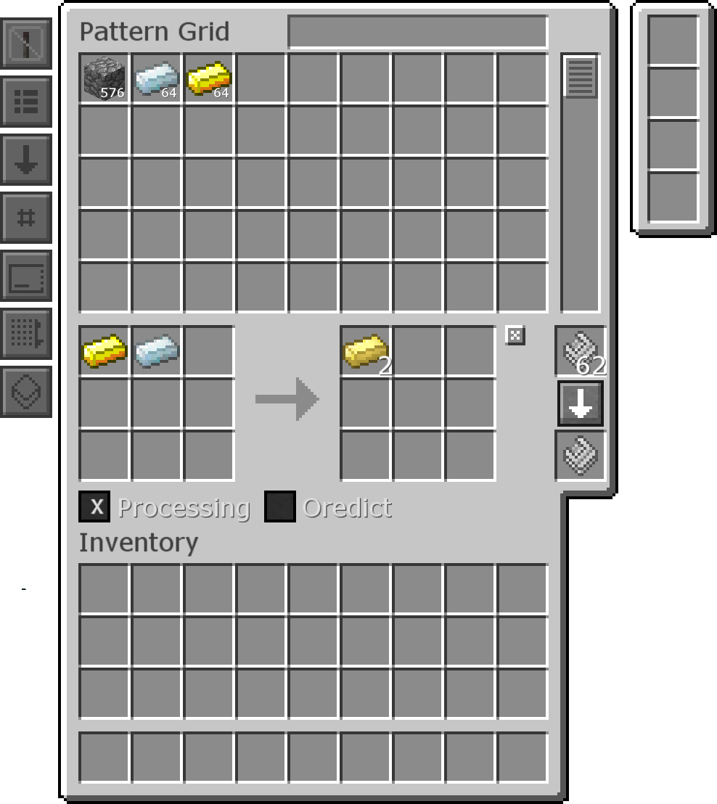

#Autocrafting

Autocrafting allows you to automatically craft items. Instead of having to manually place the recipe into the Crafting Grid, you can just click on the item and tell it how many you want to be crafted.

If the recipe you want to make is in a regular 3x3 crafting menu, just put the recipe into the Pattern Grid and click the arrow on the right to assign it to that Pattern.
You have to have Patterns in the top slot on the right.

If the recipe you want to make requires a different machine, like a Furnace or anything else that can't be done in a regular crafting table, tick the Processing box. Place the ingredients and their amounts in the boxes on the left, and then place the results and their amounts  in the boxes on the right.

If you want the recipe to use the Ore Dictionary, like being able to use any *ingotCopper* to make Copper Gears, tick the Oredict box. If you want it to only use the specific item you put in, like if you want to make sure Silverwood Planks don't get used to make a Chest, don't tick the Oredict box.

Patterns go in Crafters, which then allow the storage system to autocraft the items set by the Patterns inside.

When you place a Crafter it will point in the direction you place it, like a Piston. If it is pointing at a machine (or a Crafter that is pointing at a machine), it will try to use that machine in processing recipes. Regular crafting patterns work no matter what block the Crafter is pointing at.
