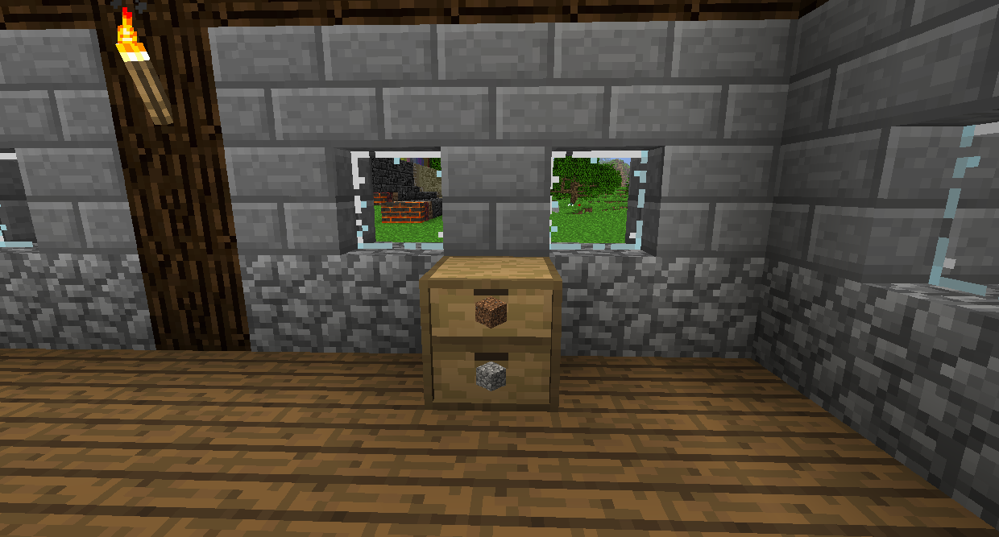
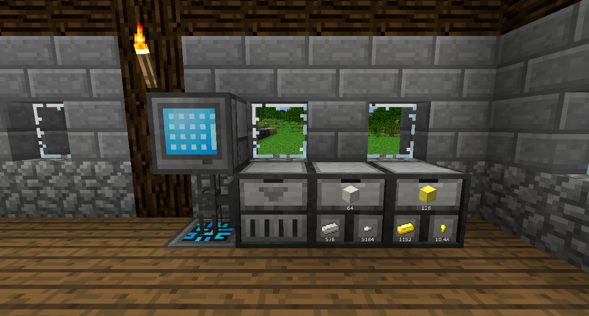
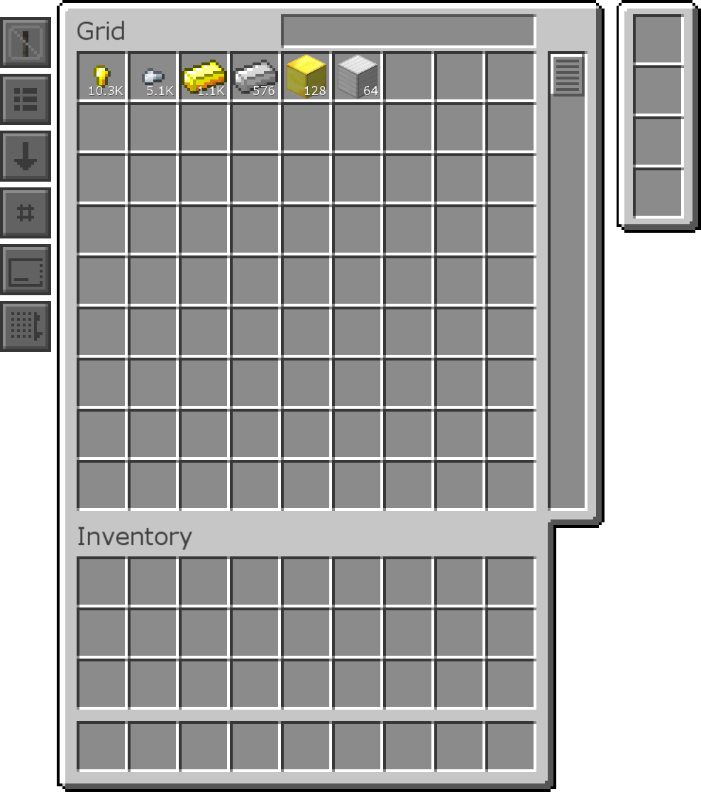

#Storage Drawers

Storage Drawers is a mod that allows you to store massive amounts of single items.
Right click an item on the face of a Drawer to store it, or double right click to store all of that item in your inventory at once. Left click to take out one item, or sneak left click to pull out a stack.

The Basic Drawer can store 32 stacks of a single item.

The 1x2 Drawer can store 16 stacks of a single item in each of its compartments.

The 2x2 Drawer can store 8 stacks of a single item in each of its compartments.

There are also half block versions of multi-compartment Drawers, which hold half their normal amount.

The Compacting Drawer will show the item in each form. If it crafts from a 3x3 and can craft into something with a 3x3 recipe, both will show here. This is great for storing metals. Storage Upgrades will apply to the largest version, so a Storage Upgrade (V) will allow you to store 32 times more Blocks of Iron, for instance

The Drawer Controller will allow you to access all connected Drawers within 12 blocks. It essentially acts like a single Drawer that has all the items in every connected Drawer.

You can sneak right click on the face with an empty hand to open the Drawer's menu, where you can see the amount of items stored, as well as any upgrades installed.

Upgrades can do special things to the drawer, generally like increasing the amount of items it can store. The Upgrade's tooltip will tell you what it does, but they'll be glossed over here as well.

Storage Upgrades will increase the maximum storage by a factor of the normal amount. Higher tiers will increase the amount by more. You do not need the previous tier to use a high tier, meaning you can have 7 max tier Storage Upgrades (which would store 224 times the normal amount) if you wanted to.

The Storage Downgrade will do the opposite, setting the max storage to 1 stack.

Status Upgrades will add a bar to the face of the Drawer to show how much it has. The first tier will only light up when it's full, and the second tier will partially light up depending on how full it is.

The Void Upgrade will destroy incoming items if the drawer is full. This is useful for when you're storing a disposable item that you're getting a lot of, like Cobblestone.

Redstone Upgrades will make the Drawer emit a Redstone signal depending on the amount of items it stores.

There are some other items that are useful for Drawers.

Normally when you break a Drawer, all the items pop out and it makes a huge mess (and lags the game if there's too many, so definitely don't do that). You can use Tape on the Drawer to make it so you can break it without losing your items.
Be warned, if you use the Drawer in a crafting recipe, it will destroy all items in it.

The Quantify Key will show the exact amount of the items stored.

The Drawer Key will lock the Drawer to that item, so even if it runs out it will not be able to fill up with anything else.

The Personal Key will make it so that only you can interact with the Drawer. Pipes and other automation will still be able to, however.

The Concealment Key will hide the item.

You can use these keys by either right clicking them on the Drawer, or right clicking on a Drawer Controller to apply it to all connected Drawers.
