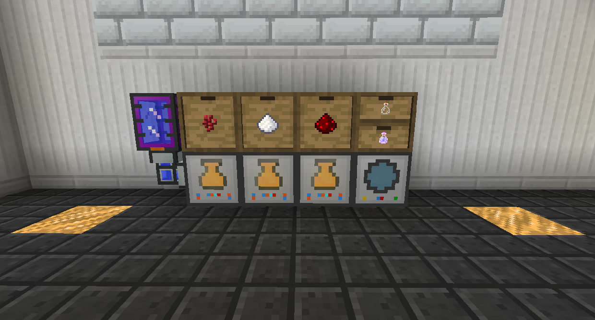

# Machine Crafting

The Compactor allows you to squish ingots into plates, and Blaze Dust into Blaze Rods.

The Centrifugal Separator allows you to un-combine items and blocks, getting back their components.

The Sequential Fabricator allows you to set a crafting recipe and then have it automatically craft it whenever it has the required items in its inventory.

The Alchemical Imbuer combines fluids and items to create potions. The potions it creates are fluids, and you will have to send them to a Fluid Transposer to put them into bottles.
If you want to create more complex potions, it would be best to place multiple Alchemical Imbuers in series.

The Arcane Ensorcellator uses Essence of Knowledge and an item to enchant books. You can use this to get pretty much any enchantment in the modpack.
