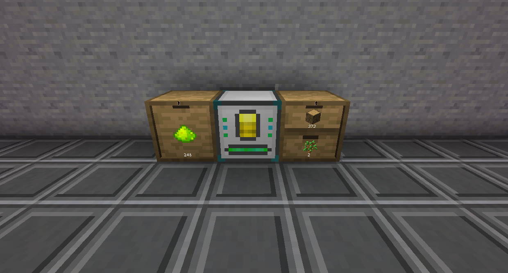

# Thermal Expansion

The Phytogenic Insolator uses Water and Phyto-Gro to grow crops. The better the Phyto-Gro, the more of the crop will be grown.

The Phytogenic Insolator is unique in that it does not interact with the outside world at all, except for importing and exporting items. Crops are grown inside the machine, instead of being planted outside and then being harvested.

You can farm trees as well if you install the Augment: Sapling Infuser.