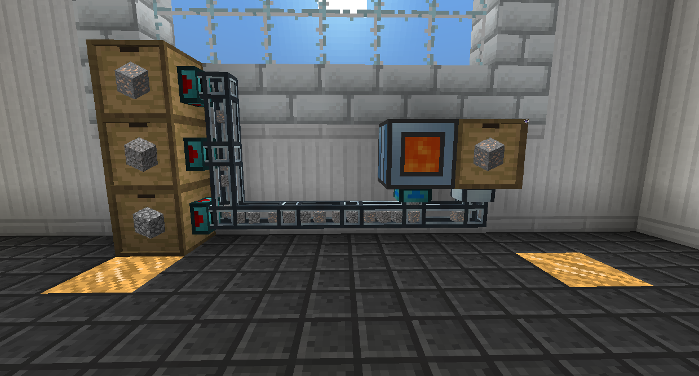

# Transportation

This chapter is dedicated to the ways you can move things from one place to another, be it power, items, fluids, or players.

Ducts are a common element of these pages, and require some more explanation here.

## Ducts

Itemducts and Fluiducts require Servos or Retrievers to function.

A Servo is used to extract items or fluids from an inventory or tank.

Place the Servo on the connection and provide it with a Redstone signal (or open its GUI and set it to not need one) and it will begin to extract items/fluids.

Items only extract if there is somewhere for them to go, but fluids will be extracted regardless.

Items will try to go to the nearest inventory it can enter, while fluids will just fill anything it can.

If a Servo sends an item but it has nowhere to go, the item will return to the Servo and backstuff. A backstuffed Servo will begin to work again if it has somewhere to put the item.

You can disconnect a connection between Ducts or between a Duct and a block by right clicking the connection with a Crescent Hammer.

Retrievers work the same as Servos, but they are placed on the destination instead of the source. This is good in case you have multiple sources that you want to pull from.

Filters are placed on the destination and restrict what items or fluids can enter it.

You can set a filter on Servos, Retrievers, and Filters. Higher tiers have better customizability, with more slots and options.

• Items in a Whitelist are the only items allowed, and items in a Blacklist are the only items NOT allowed.
• Metadata makes up things like tool damage, so if you want to only allow items that are undamaged you would want to use Metadata.
• NBT makes up things like the contents of an inventory, so if you want to only accept Buckets filled with a specific fluid you would want to use NBT.
• The Ore Dictionary allows multiple items to act like the same thing, so if you want to accept all types of wood you would want to not ignore Ore Dictionary.
• If you want to allow everything from the mod Actually Additions, you could put any item into it and then set it to not ignore Mod Owner.
• You can toggle over-sending to allow pipes to try to put more items than can normally fit into the block. This is especially useful for the Nullifier, which only has one slot but deletes whatever enters it.
