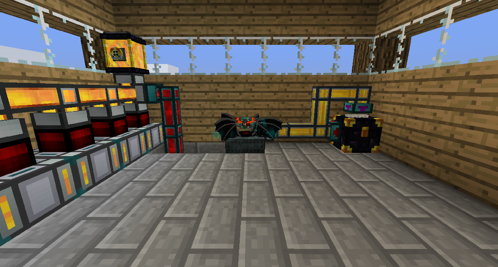
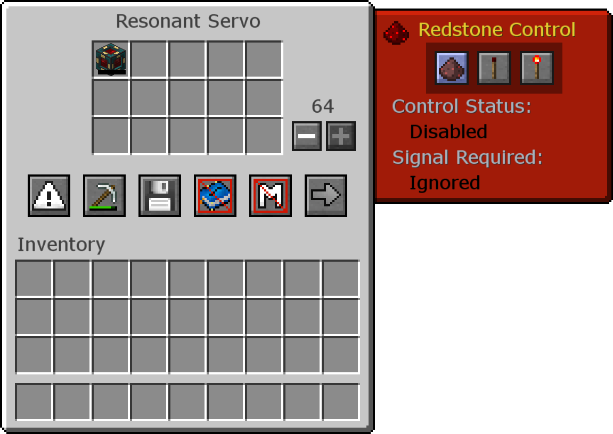
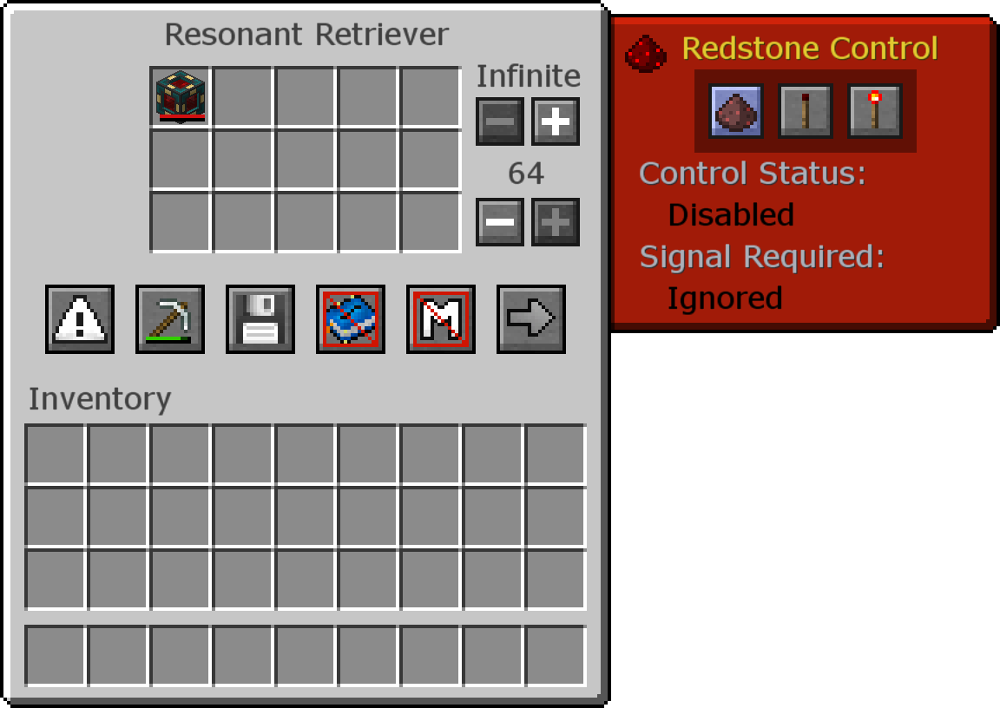
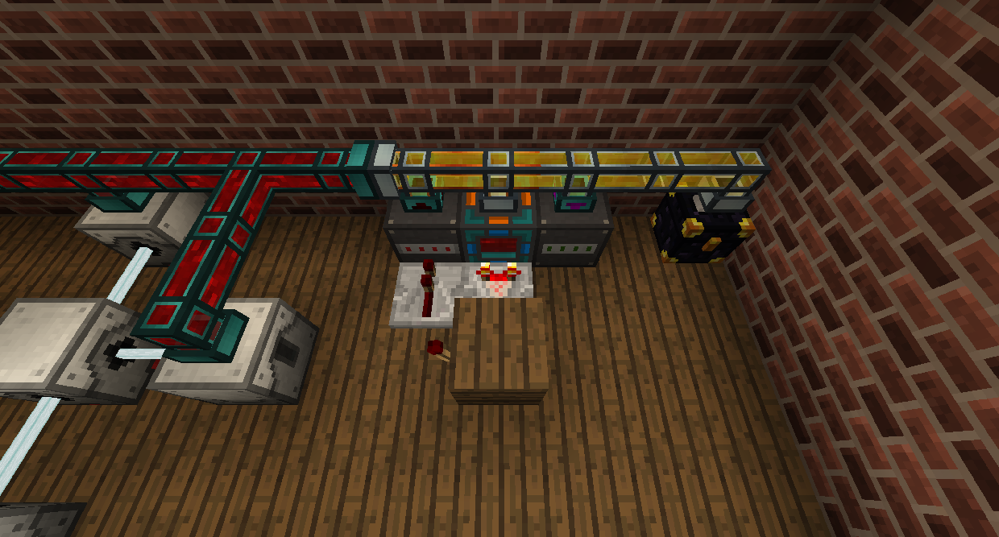
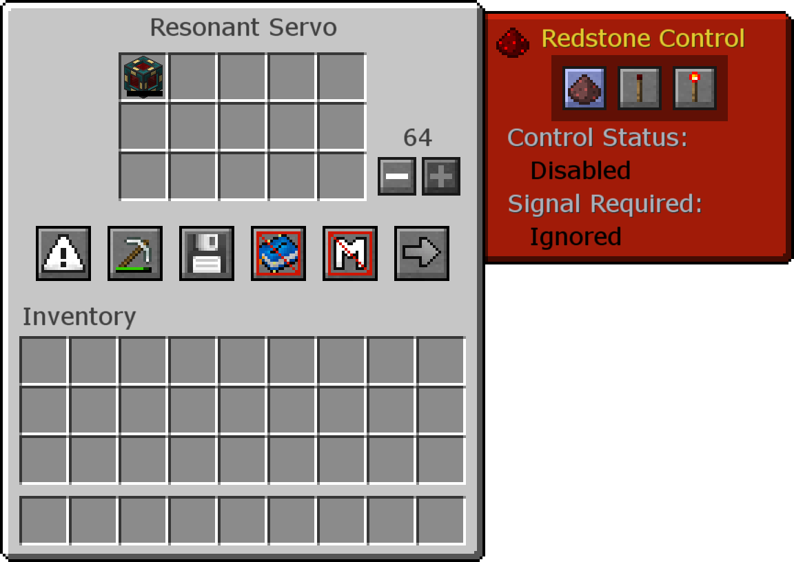

# Transfer Over Distance

Advanced Energy Tesslocators are fairly confusing to use, and aren't in a lot of modpacks. This page will teach you how to wirelessly transfer energy in a more complex but reliable way.

At your main base, connect power to an Energy Infuser (or any other machine that charges items). Then, place an Ender Chest nearby. Connect Itemducts to two sides of the Ender Chest, and one side of the Energy Infuser.

Place a Servo that's at least Reinforced tier on the connection closer to the Energy Infuser, and a Retrieiver on the other.

In the Servo, set a whitelist for an empty Energy Cell and set it to ignore Redstone. This will send empty Energy Cells to the Energy Infuser to fill up.

In the Retriever, set a whitelist for a **full** Energy Cell and set it to ignore Redstone. This will pull the full Energy Cell from the Energy Infuser and insert it into the Ender Chest.

At the location you want to use the RF, place another Ender Chest. Connect an Auto-Placer and an Auto-Breaker to it using Itemducts.

Place a Retriever on the Auto-Placer and set a whitelist for full Energy Cells. This will make it pull full Energy Cells from the Ender Chest and place it in the world, where you can use Fluxducts or other pipes to pull RF out.

Place a Servo on the Auto-Breaker and set a whitelist for empty Energy Cells. Also set the Auto-Placer to Redstone Mode: Pulse by clicking it with a Redstone Torch.

Place a Comparator facing away from the Energy Cell and immediately invert the signal, and return that to the Auto-Placer. That way, it will break the Energy Cell when it is out of RF.

Now, Energy Cells will fill at your base, move to where you want to use it, empty itself into machines, and then return to refill when needed. You can put multiple Energy Cells in to make sure you're never without power as well.
