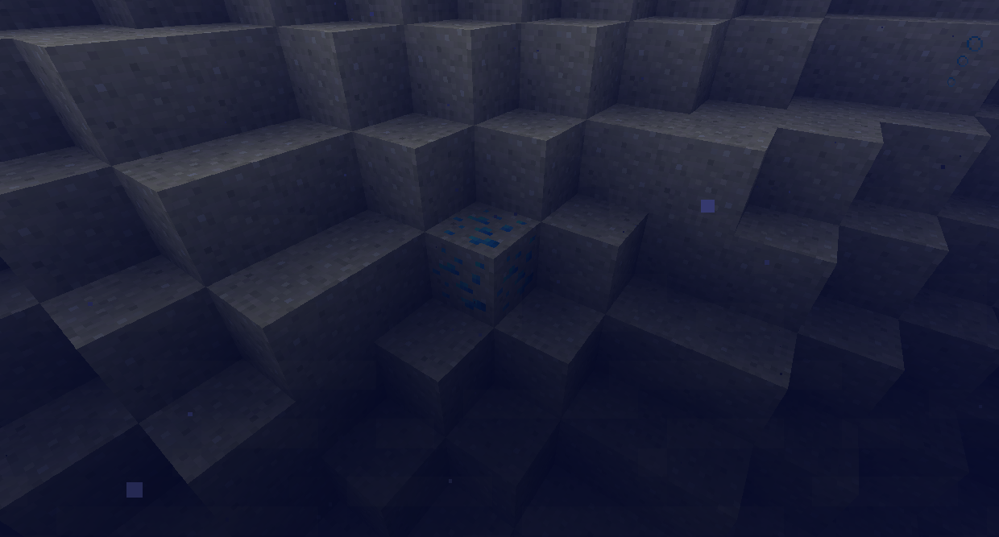

#Ores
There are a lot of extra ores added by mods.
You can hit R on them in your inventory or in this page to see where they generate.

## Thermal Foundation
Thermal Foundation adds these ores:

It also adds these ores, which temporarily spawn a bit of their fluid when they are broken.

Oil Sand and Oil Shale will drop Bitumen and a splash of Crude Oil.

Destabilized Redstone Ore will drop Destabilized Clathrate and a splash of Destabilized Redstone.

Energized Netherrack will drop Energized Clathrate and a splash of Energized Glowstone (which flows upwards and gives you Jump Boost, Speed, and Glowing).

Resonant End Stone drops Resonant Clathrate and a splash of Resonant Ender (which teleports you randomly within 8 blocks).

## Tinkers' Construct
Tinkers' Construct adds these ores to the Nether.

## Astral Sorcery
Astral Sorcery adds Aquamarine Shale, which can spawn underwater in beaches.

## Actually Additon
Actually Addition adds Black Quartz Ore
