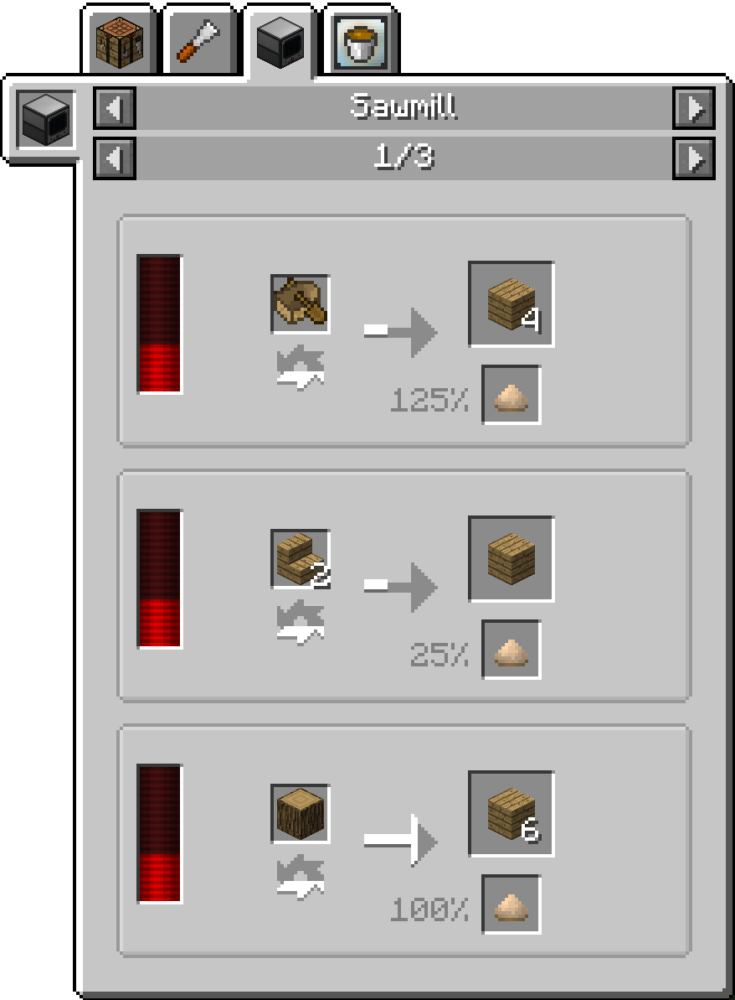
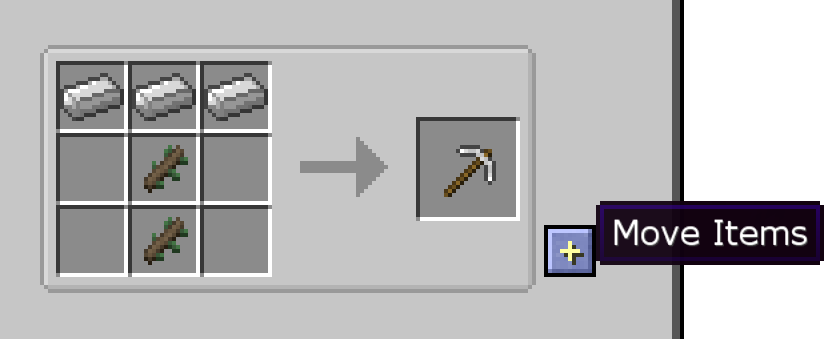
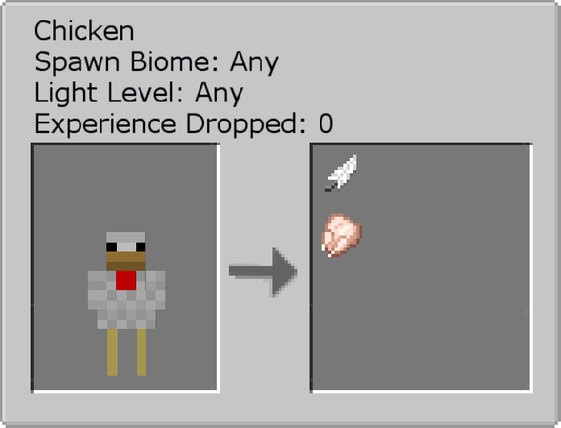
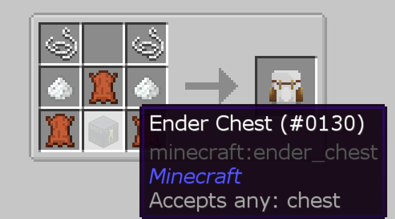

#Just Enough Items

The mod Just Enough Items adds everything boxed in yellow. On the right, you can find every block and item in the modpack. By default, you can click any item, or hover over the item and then hit R, and you will see the crafting recipe for that item.

On the left of this menu, you can see everything that you can craft that recipe in. At the top, you can see all the different methods it can be crafted.

For instance, you can get 6 Wooden Planks when you put a log into a Sawmill and provide it with energy (the red bar on the left).

You can left click on an item, or hover over it then hit U, to see all the uses for that item.

Again, on the left you have everything that can use those recipes, and on top you have all the different machines it can be used in.

Recipes that use fluids will display the amount in mB, which stands for millibuckets. 1000mB is equal to one bucket of that fluid.

You can press the + button the the right of recipes to automatically move those items to their respective slots in the crafting table.

The text box at the bottom is the search bar. Type things in it to filter the item list. You can type @ followed by the mod name to filter to only items from that mod.

You can also search for naturally spawning blocks to see where they spawn, see mob drops, plant drops, and dungeon loot.

Some recipes use something called the Ore Dictionary. This isn't a block or item, but a mechanic to allow multiple items to work in place of each other in certain recipes. An example would be a machine needing ingotCopper, which would be a Copper Ingot from any mod. JEI will rotate through all items in the Ore Dictionary that will work with the recipe, and you can hover over it to see what it needs.

You can hover over items and hit A to save them to your bookmarked items, which will appear to the left of the inventory and stay there until you hit A on them again. You can temporarily hide the bookmarks by clicking the button at the bottom left corner.

The wrench button next to the search bar opens the config menu for JEI, where you can customize the mod settings as you like. If you are a server moderator or in a world with cheats enabled, you can hold control and click the wrench button to enable cheat mode.
In cheat mode, left clicking items in the item list will give you a stack of that item, and right clicking will give you one.

When you're hovering over an item in your inventory or in JEI, you can see what mod it's from under the name of the item.

