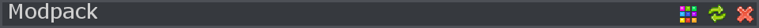
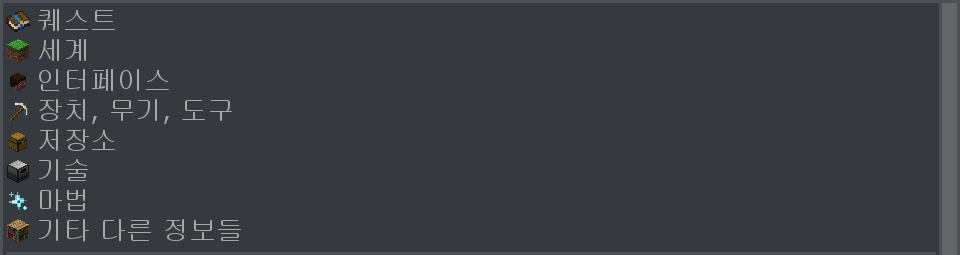

FTB Academy는 마인크래프트 모드팩 초보자들에게 모드팩을 즐기는 방법을 알려주기 위해 만들어진 모드팩입니다. 이제부터 당신에게 모든 중요한 개념들과 유명한 모드들에 대해 알려드릴 테니, 다른 복잡한 모드팩에서도 여기서 배운 지식들을 잘 써먹어 보세요.

다른 사람들과 함게 게임을 하고 있다면, 팀을 만들어 같이 하는 사람들과 퀘스트 진행도를 공유할 수 있습니다. 인벤토리 왼쪽 위의 My Team 버튼을 눌러 팀 관련 설정이 가능합니다.

가이드 창 최상단에서 현재 보고있는 페이지의 경로를 볼 수 있습니다. 이전 페이지들의 제목을 눌러 해당 페이지로 이동할 수 있습니다. 백스페이스를 눌러 바로 상위 페이지로 돌아갈 수도 있습니다.

오른쪽 상단의 버튼들은 순서대로 테마를 변경하거나, 가이드를 새로고침하거나(모드팩 제작자에게 매우 유용합니다!), 가이드 창을 닫는 버튼입니다. E키나 esc 키를 눌러 가이드를 닫을 수도 있습니다.

그 바로 아래에는 현재 페이지에서 이동 가능한 페이지들의 목차가 있습니다. 페이지 이름을 클릭해 해당 페이지를 여세요.

어떤 이미지들은 커서를 올렸을 때 추가적인 글자가 나타나기도 합니다.

