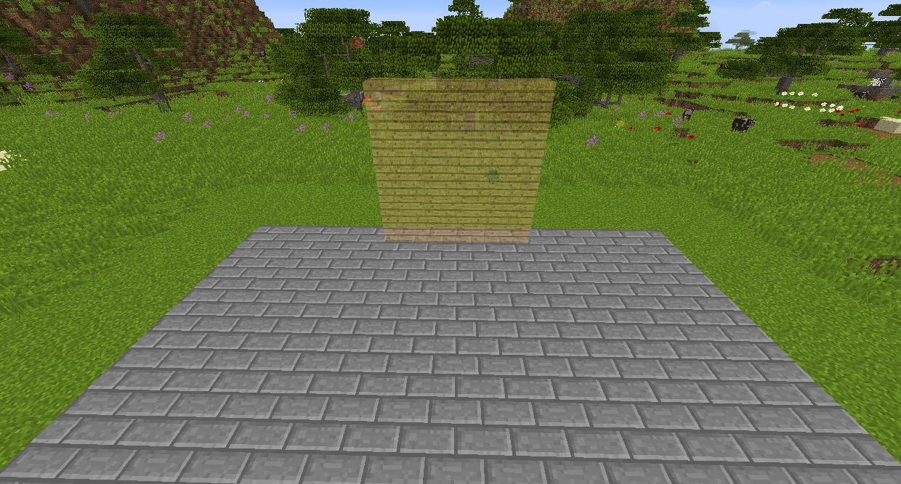
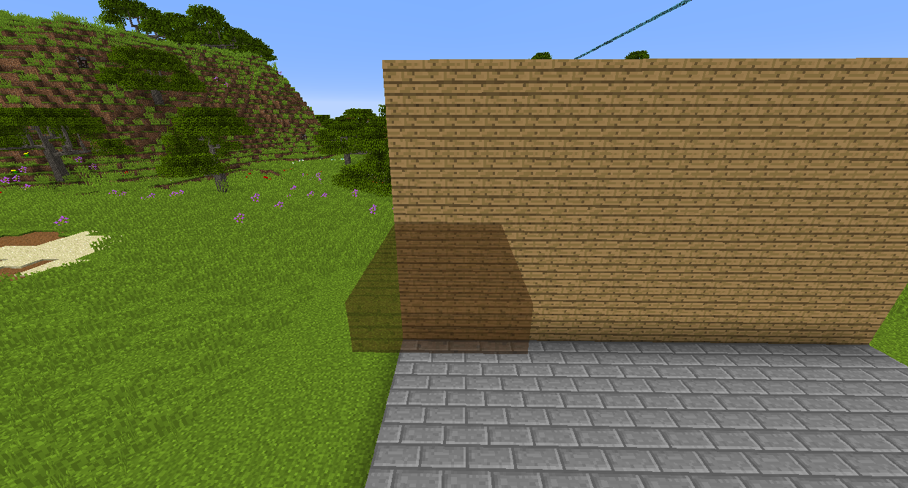
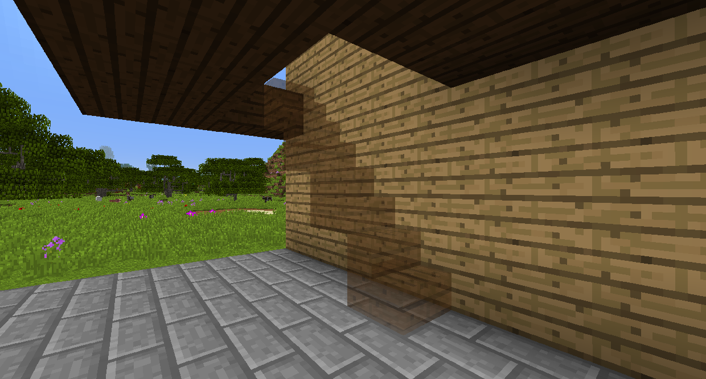
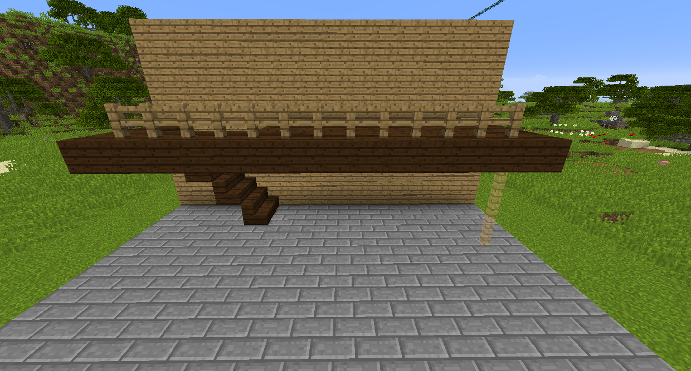

# 빌딩 가젯

빌딩 가젯(Bulding Gadget)을 이용하면 벽이나 계단같은 간단한 구조물들을 빠르게 설치할 수 있습니다.
블록을 웅크린채로 우클릭해 설치할 블록으로 지정한 후, 우클릭시 홀로그램에 보여지는 대로 블록이 설치됩니다.

건축 모드

Build to Me 모드는 바라보는 지점에서 당신이 서있는 위치까지 일직선으로 블록을 설치합니다.

Grid 모드는 설정된 범위(range)에 따라 그리드 형태로 블록을 설치합니다.

Vertical Wall 모드는 설정된 범위에 따라 정해지는 크기의 정사각형 벽을 설치합니다.

Horizontal Wall 모드는 설정된 범위에 따라 정해지는 크기의 정사각형 바닥을 설치합니다.

Surface 모드는 바라보는 면을 설정된 범위에 따라 확장시킵니다. 이 모드는 추가적인 옵션들을 더 설정할 수 있습니다. 오른쪽 Fuzzy 모드를 활성화하면 흙이나 잔디, 돌이나 안산암 등 정확히 바라보는 블록만이 아닌 비슷한 블록들도 같은 면으로 인식합니다. 따라서 이 모드를 키면 다른 종류의 나무 판자들로 이루어진 벽도 확장할 수 있습니다. Connected Surface 모드를 활성화하면 대각으로 연결된 블럭들도 한 면으로 인식합니다.

Stairs 모드는 바라보는 방향이 위냐 아래냐에 따라 아래/위로 이어지는 계단을 설치합니다.

Horizontal Column 모드는 내가 바라보는 쪽으로 가로로 블록을 설치합니다.

Vertical Column 모드는 위/아래 방향으로 기둥을 세웁니다.