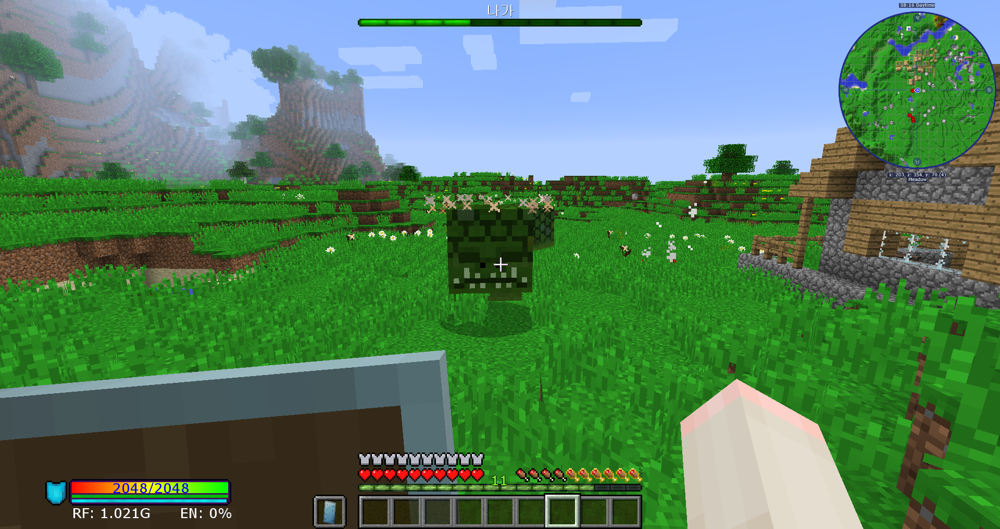

# 초반 보스

### 나가

나가(Naga)는 커다란 뱀의 모습이며, 나가의 뜰(Naga Courtyard)에서 발견할 수 있습니다. 나가의 뜰은 대부분 숲 지형에 생성됩니다.
나가는 당신을 둘러싸고 쫓아 올 것이며, 공격하기 위해 당신에게 달려들 것입니다. 나가는 전신 어느 부위를 공격해도 데미지를 줄 수 있습니다. 체력이 줄어들면, 점점 더 짧아지게됩니다. 나가를 잡는 데 특별한 전략은 필요 없습니다. 그냥 죽을 때까지 후드려 패세요. 나가가 돌진해올 때 방패로 막으면 나가를 기절시킬 *수는* 있습니다.

나가는 나가 비늘과 나가 트로피를 떨어뜨립니다. 이 전리품들을 한번이라도 얻으면 리치의 탑에 접근할 수 있게 됩니다.

### 리치

리치(Lich)는 리치의 탑(Lich Tower)에서 발견할 수 있는 스켈레톤 왕입니다. 리치의 탑은 대부분 숲 지형에 생성됩니다.

만약 당신이 아직 나가를 죽이고 아이템을 얻지 못한 상태면, 리치의 탑은 마법으로 보호되어 있어 몬스터들은 피해를 입지 않고, 블럭들은 부서지지 않습니다.

리치의 탑의 맨 윗층에서 리치를 찾을 수 있습니다.

리치는 세 단계의 공격패턴을 가지고 있습니다.
맨 처음 리치는 당신의 모든 공격의 피해를 무시하며 당신을 공격하는 두 수하를 부립니다. 파란색 투사체는 리치에게 반사시켜 방패를 부술 수 있으며, 주황색 투사체는 폭발합니다. (1단계)
리치의 모든 보호막이 부서진다면, 리치는 좀비를 소환하여 당신을 공격합니다. (2단계)
모든 좀비를 죽이면 리치는 황금 검을 들고 직접 당신을 공격할 것이며, 이 때부터 당신은 리치에게 피해를 입힐 수 있습니다. (3단계)

리치를 죽이고 전리품을 얻으면, 당신은 늪지, 어둠의 숲, 눈덮힌 숲 지형에 들어갈 수 있게됩니다.

리치를 처치하면, 4종류의 Scepters 중 하나를 떨어트립니다.

황혼의 지배(Scepter of Twilight)를 사용하면 첫번째 페이즈에서 리치가 사용하던 파란색 투사체를 쏠 수 있습니다. 각 투사체는 하트3개의 피해량을 가지고 있습니다. 99번 사용 가능하며 엔더진주로 재충전할 수 있습니다.

생명의 지배(Scepter of Life Draining)를 사용하면 지정된 어떤 몬스터든 생명력을 빼앗아 사용한 플레이어를 회복시킵니다. 99번 사용이 가능하며 발효된 거미 눈으로 재충전할 수 있습니다.

불사의 지배(Zombie Scepter)를 사용하면 리치가 소환한 것과 비슷한 강화좀비를 소환하며, 강화 좀비는 소환 된 이후 일정 시간이 지나면 불타 죽습니다. 9번 사용이 가능하며 썩은고기와 힘 II 물약으로 재충전할 수 있습니다.

Scepter of Fortification를 사용하면 플레이어 주변에 방패들을 소환합니다. 방패들은 모든 종류의 물리 피해를 막아주며, 그 후 사라집니다. 9번 사용이 가능하며 황금 사과로 재충전할 수 있습니다.
