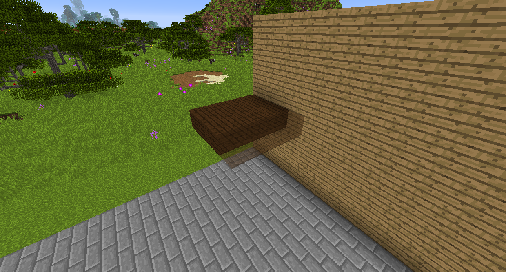

#Building Gadget

The Bulding Gadget allows you to quickly build simple structures like walls and stairs. 
Sneak right click on a block to set the Gadget to build that block, and right click to build where the hologram shows.

Building Modes

The Build to Me mode will attempt to make a straight line of blocks from where you're pointing to you.

The Grid mode will make a grid of the block you set it in the area defined by the range.

The Vertical Wall mode will make a wall, with the length of each side defined by the range. 

The Horizontal Wall mode will make a floor, with the length defined by the range.

The Surface mode will place blocks on every block of the type you're looking at, with the area depending on the range. This mode has additional options. Enabling Fuzzy will allow it to work on all similar blocks instead of the exact same block, so for instance different wood types will both count as the same block. Connected Surface will require that all the blocks touch for them to be placed on.

The Stairs mode will place blocks diagonally downward or upward, depending on if you're above or below the block.

The Horizontal Column will place a row of blocks on the opposite side of the block you're looking at. 

The Vertical Column will place a pillar of blocks straight up or down.