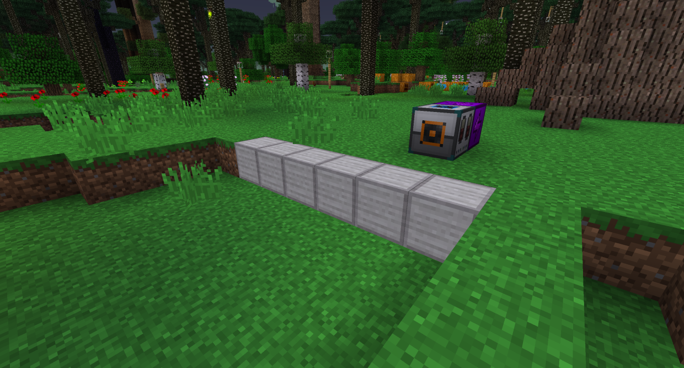
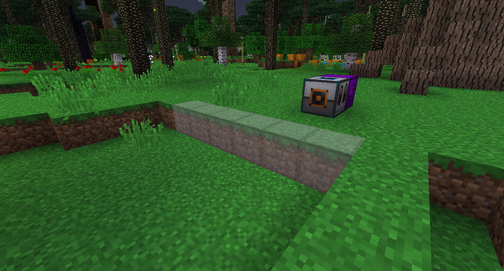
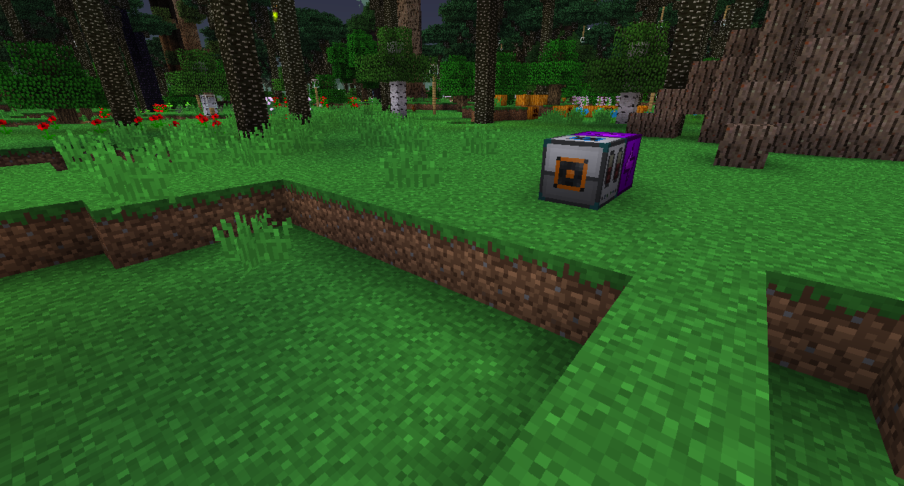

#Construction Paste
Construction Paste can take the appearance of any block, but it won't mimic any special features about it. Gadgets will use Construction Paste from your inventory if it does not have enough of the actual block.

To get Construction Paste, place Construction Powder next to water and then break the resulting block. You can store it in a Paste Container by right clicking it while you have Paste in your inventory.

