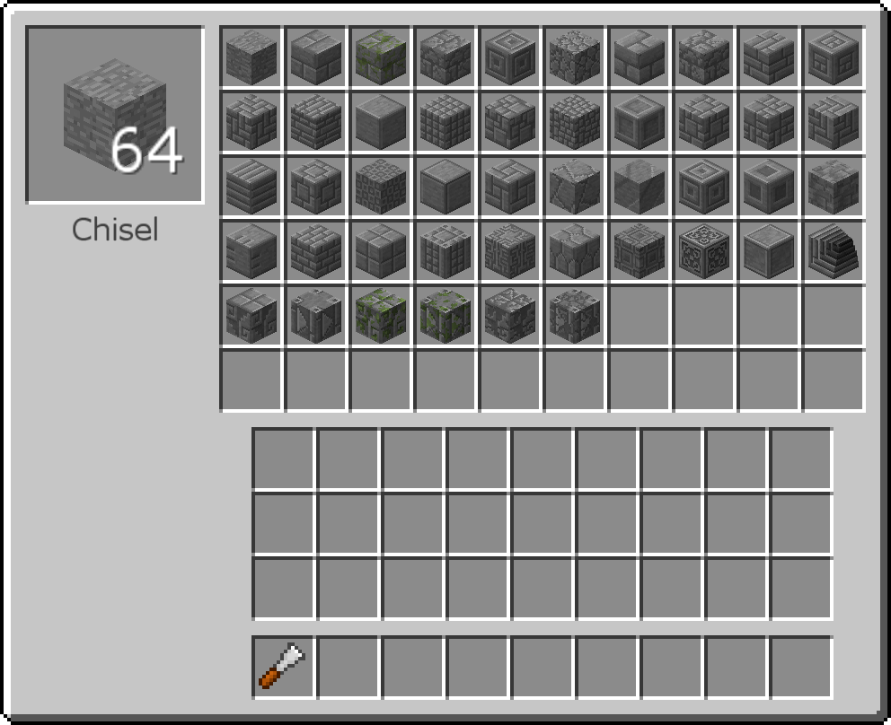
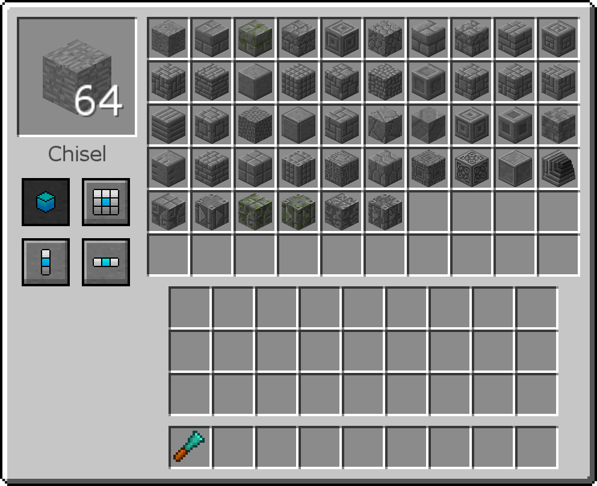
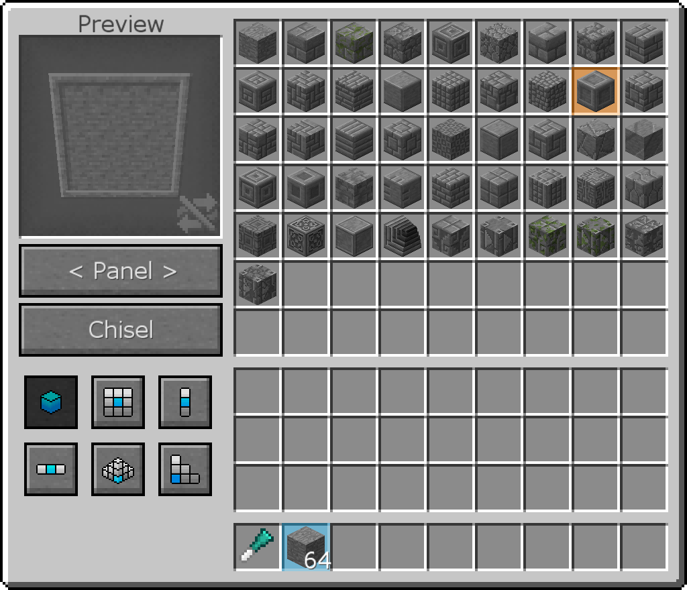
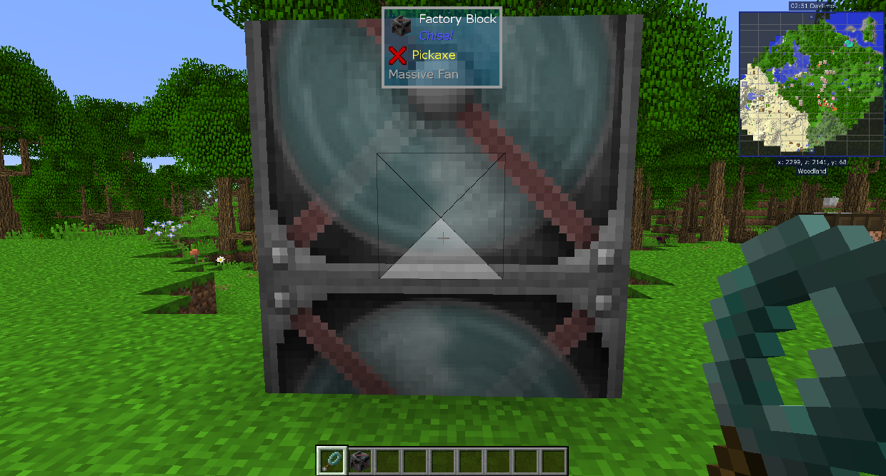

# Chisel

The Chisel mod adds a huge amount of decorative blocks, and 4 tools to helpe make them.

The first Chisel is the most basic. Open it, put a block in, and on the right you can take out the version you want. If you put a chiseled block in the input slot, you can left click the Chisel on blocks in the world to chisel them without having to break and replace them.

The Diamond Chisel lasts longer and has more options for chiseling blocks in the world. With the 4 buttons on the left, you can choose to chisel one block, a 3x3 area, 3 vertical blocks, or 3 horizontal blocks at the same time.

The iChisel works slightly differently. Instead of inserting the block and taking the chiseled block out, you select the block you want to chisel from your inventory and then you choose what you want to turn it into on the right. On the left you can see what the block will looks like. You can change the shape of the blocks by pressing the button below. You can click Chisel to chisel the stack you have selected, or hole sneak and click to chisel all blocks of that type in your inventory at once. There are also more options for chiseling in the world.

Some blocks have textures that spawn multiple blocks. However, they might not be centered where you want them to be. The Ender Offset Wand helps with this.

Hold the Ender Offset Wand and look at the blocks. Click it in the direction you want to shift the textures in. So, if the texture is one block too high, click the bottom of the block.

The Auto Chisel will automatically chisel blocks you insert into it. Place a Chisel into the middle slot, place the version of the block you want in the middle bottom slot, and then input the blocks into the left side and they will be output into the right side.

