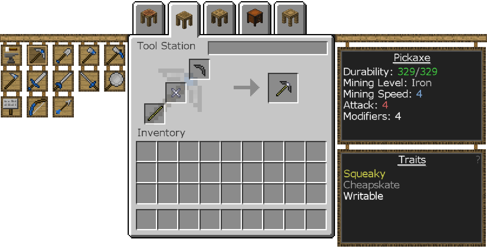
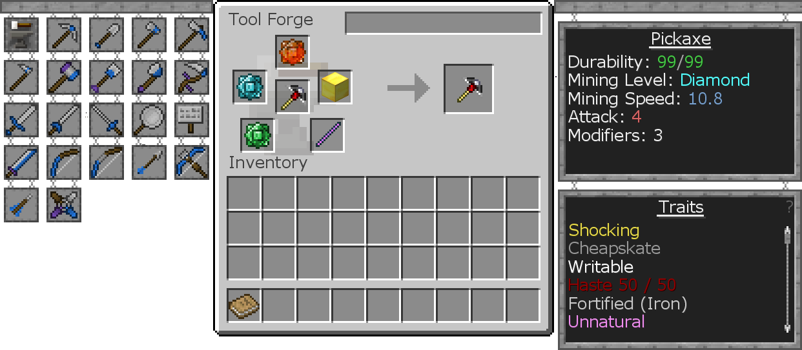

#Making Tools
First, you'll want to craft these blocks.

The Crafting Station works like a regular Crafting Table, but items will stay inside if you leave it before emptying it. You can also see inventories touching it as well as all other Tinkers' Construct blocks as tabs at the top.

The Stencil Table turns Blank Patterns into tool part Patterns, which are needed to make tools. Place Blank Patterns into the left slot and click the Pattern you want on the left to make it.

You can store these Patterns in a Pattern Chest.

The Part Builder is where you combine a Pattern and a material to create a tool part.

Click the buttons on the left to choose the Pattern, and then put a material in one of the slots next to it. The text box to the right will update to show the statistics for that material for each part. You can hover over the statistics to see more information.

You can only make parts out of non-metals in the Part Builder. Metals need the Smeltery, which will be covered later.

If the Part Builder is touching a Pattern Chest, you can take Patterns from it without having to open it.

The Tool Station is where you combine parts to create a tool.

Click the tool you want to craft on the left, and then place the tool parts in their respective slots.
The right side will tell you its stats and traits according to the parts used to make it.

The pickaxe in the image below (made of a Stone Pickaxe Head, Paper Binding, and a Sponge Tool Rod) can mine Iron Ore and anything "softer," like Coal Ore and Stone, but not anything like Diamond or Redstone.
You can give it a name by typing in the text box at the top.

You can also add modifiers in the Tool Station by placing the finished tool in the middle slot in the first page and putting modifier items in the surrounding slots. 
See Materials and You for information on what modifiers are available for your tool.
Tools can only have a limited amount of modifiers. The amount remaining can be seen on the right side of the Tool Station when a tool is inside it.

The Tool Station can only make a limited group of tools. To make more, you need to make and use the Tool Forge, which works identically to the Tool Station, just with more tools available to craft. You can make a Tool Forge out of pretty much any metal block, but the difference is only aesthetic.

Hovering over a tool in your inventory will show you the modifiers and statistics, as well as the tool level. When the mod Tinkers' Tool Leveling is installed (which it is in this modpack), using a tool will give it experience. Leveling up a tool will give it an extra modifier!

You can swap out tool parts by combining the fully repaired tool with the tool part you want to install on it. This will get rid of the tool part you're replacing, along with any trait it provided.

If you want to upgrade the mining level of a tool without changing its stats or traits, you can use a Sharpening Kit. This will only change the tool's mining level, leaving everything else alone. This does not use a modifier and can be done multiple times. You can also craft them with your tool to repair it, if they're both made of the same material.

Embossing allows you to add the trait of a tool part to a tool without replacing tool part. So if you really like the trait a tool part but don't like the stats, you can emboss that tool part onto the tool instead of replacing the part onto it!
