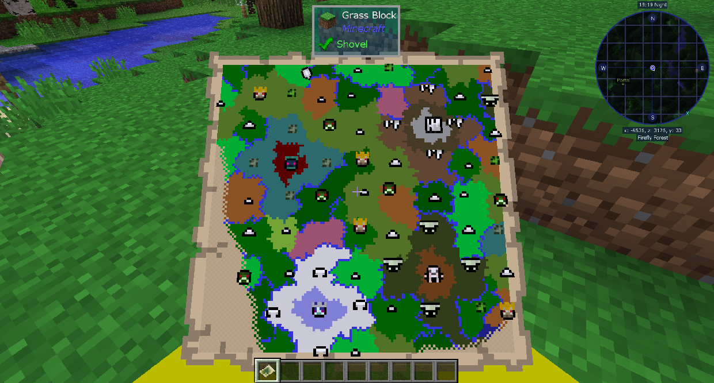

#Bosses

The progression in the Twilight Forest is linked to bosses. Each boss spawns in its own biome and its own structure, which you cannot enter without defeating the previous boss.

The best way to navigate the Twilight Forest is using the Magic Map. Craft a Blank Magic Map and right click it to open it. It will color code based on biome, with icons where structures are. You can use these to find the bosses.

You have to defeat the Forest bosses first in order, and then you can do the Swamp, Ice, or Dark Forest biomes in any order (although each has their own progression).
