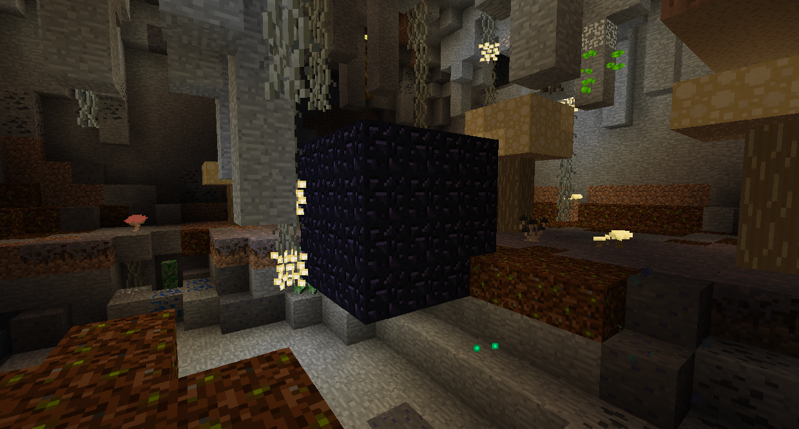

#Highlands bosses

If you have not defeated the Ur-Ghast, Hydra, and Snow Queen, the Highlands will have a downpour of acid rain that deals heavy damage.

First things first, you'll want to go underground into the Troll Caves. It will be full of Trolls, as the name suggests. Killing Trolls will light up nearby Trollvidr, providing a natural source of light.
What you want to find is a small Obsidian vault. Dig into it and retrieve the Uberous Soil and Magic Beans from within.

Go back to the surface and get just outside from under the Cloud Cottage up above. Place down some Uberous Soil and plant a Magic Bean. Climb the Beanstalk up to the Cloud Cottage.

Take out the Giant Miner to get the Giant Pickaxe, which can mine giant blocks. Go back down to the Troll Cave and use the Giant Pickaxe to mine into the Giant Obsidian vault and take the Lamp of Cinders.

The Lamp of Cinders will allow you to access the Thornlands. Right click on Thorns to burn them, allowing you to walk through them. If you haven't gotten the Lamp of Cinders, the Thornlands will have acid rain.

Once you've reached the Castle, you're basically done. Twilight Forest isn't complete yet, and there's currently no final boss. You can take over the Castle and live in it if you want, but there's nothing really to do here.