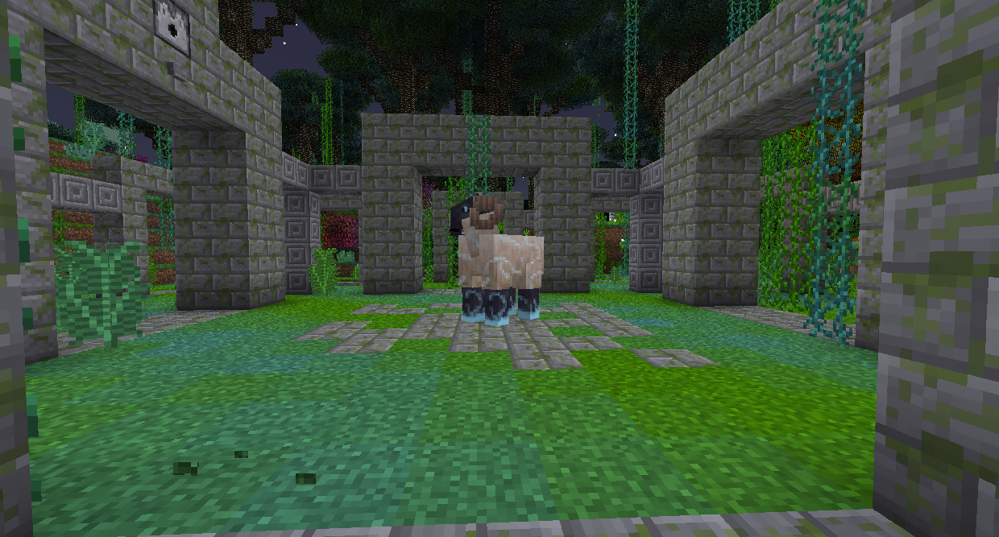
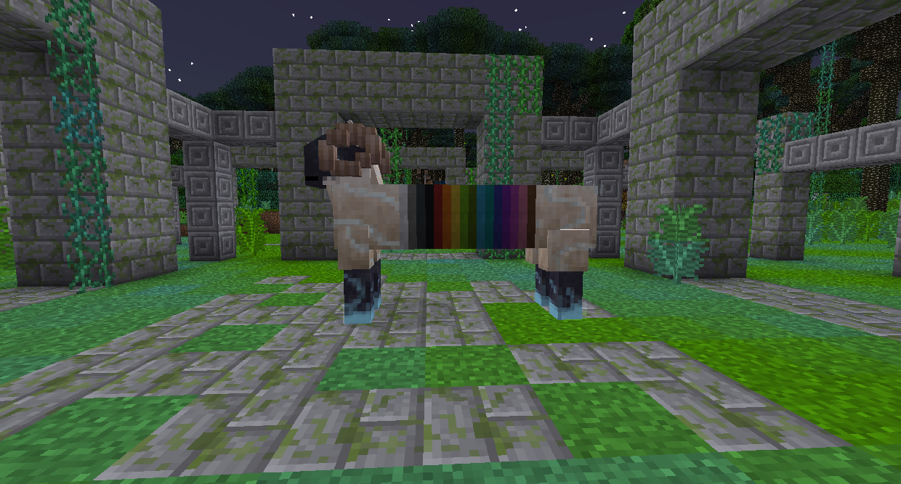

#Questing Ram

The Questing Ram is a passive boss found in the Quest Grove, which spawns in the Enchanted Forest biome.

Instead of killing the Questing Ram, you are supposed to give it one of each color Wool. As a reward, it will give you a Block of Lapis, Iron, Gold, Diamond and Emerald each. It will also give the Crumble Horn, which will turn Stone into Cobblestone, into Gravel, into Dirt.
