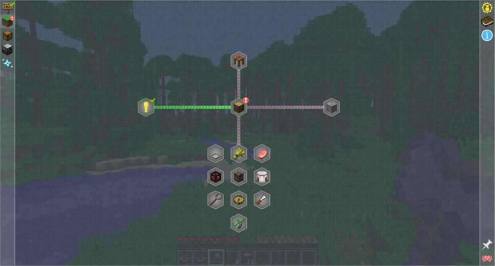
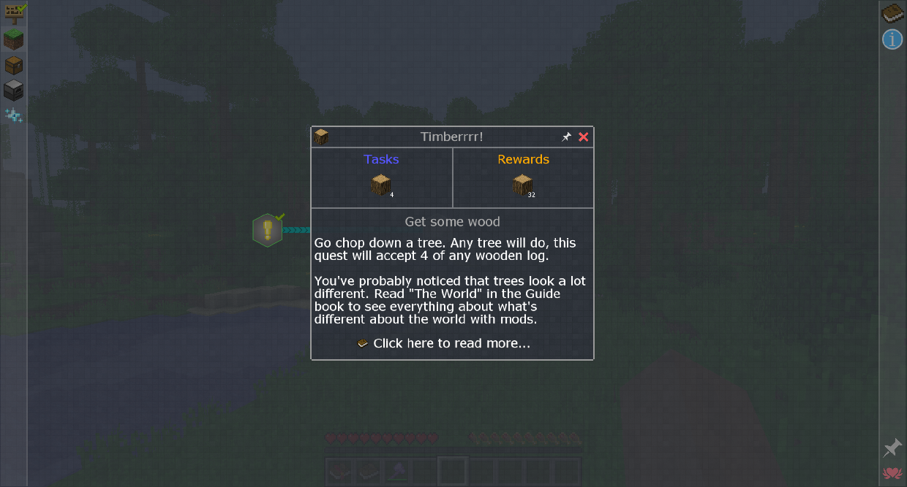
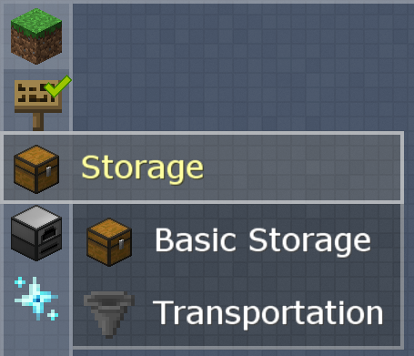
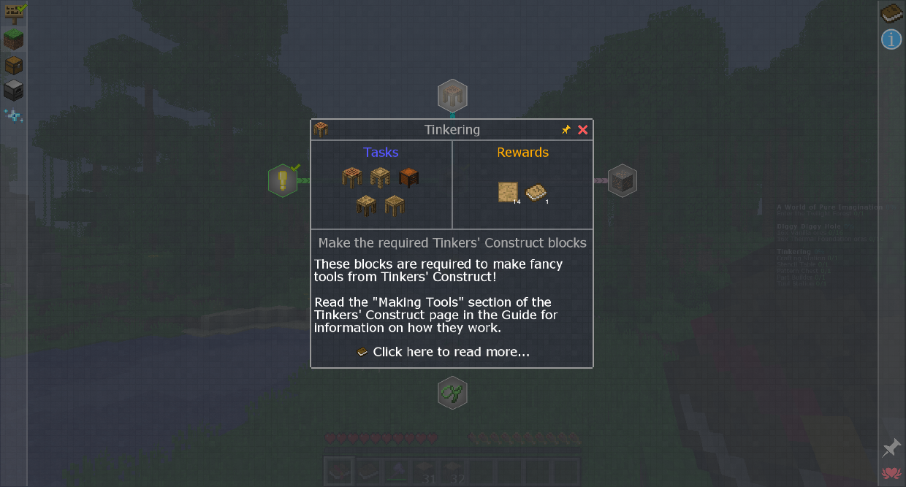
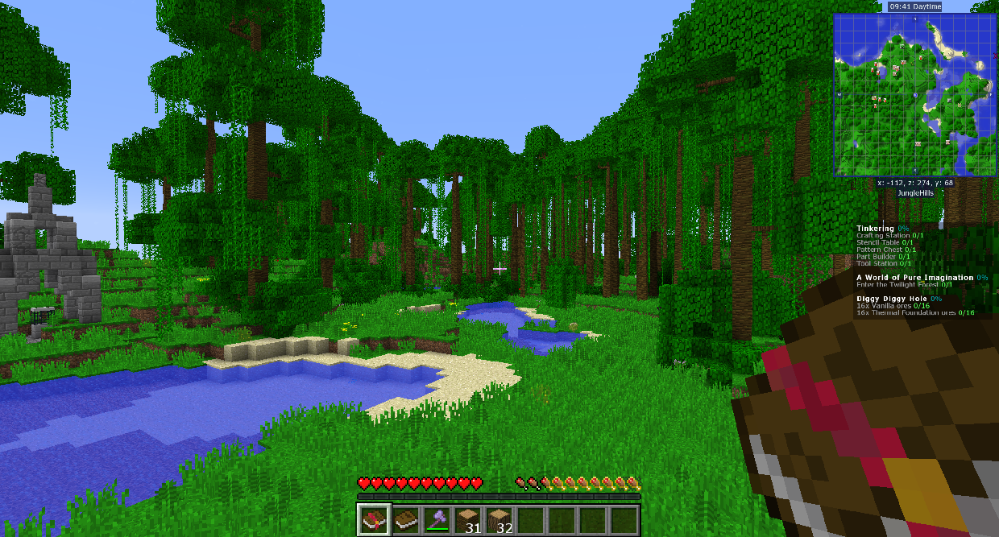

# Quests
## Like the guide, but with less reading

The quest menu is opened by clicking this button in your inventory:

A light gray quest is able to be completed, a blue quest is partially completed, a green quest is completed, and a dark gray quest is locked and can't be completed.

Some quests can't be seen until all of its required quests have been completed, while some others can be seen but just not completed.

Click on a quest to open it. There you can see its tasks and rewards.
Item tasks are automatically completed when you have the required amount of that item in it.

If multiple people are in the same team using FTB Utilities, they share quest progress.

Quests are separated into chapters and subchapters, which are listed on the left of the screen. Hover over an icon to show its name and any subchapters it has.

You can pin quests by clicking the little tack button, which will make it remain on screen while playing.
You can also click the tack button at the bottom right to automatically pin all quests that are unlocked.
