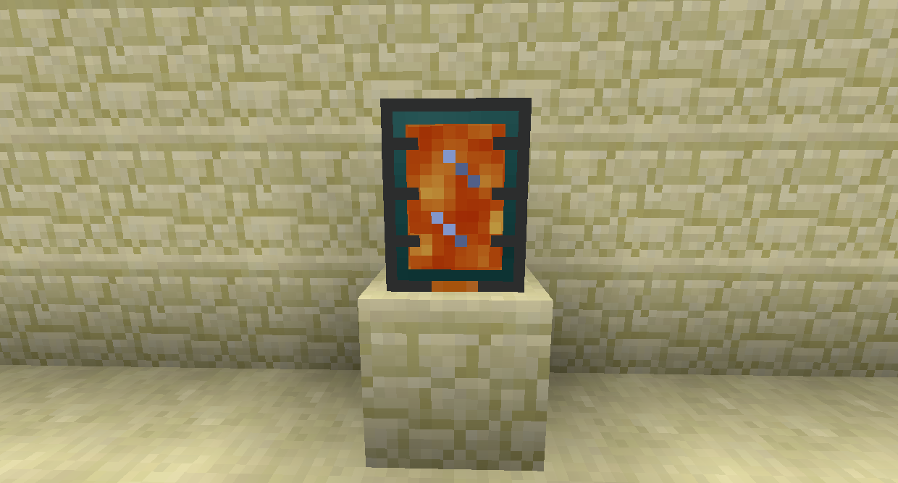
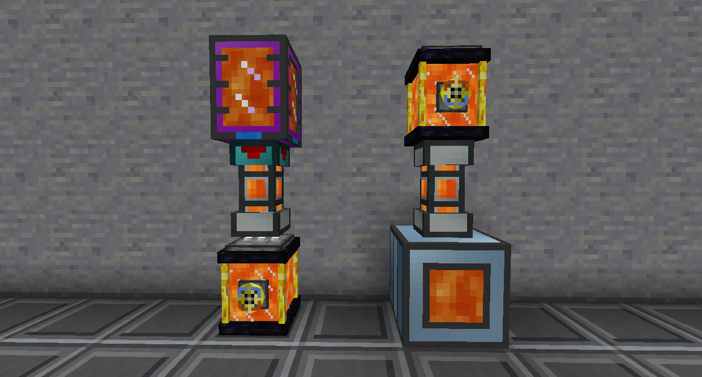

# Fluid Storage

Portable Tanks store fluids, even when broken. Use a Crescent Hammer on it to toggle auto-output. When it's in auto-output mode, it will automatically try to push the fluid into whatever container is directly beneath it, like pipes or machines. You can sneak right click the Crescent Hammer on the Portable Tank to break it instantly.

The Basic Portable Tank stores 20 buckets and can be upgraded to hold more with Upgrade Kits. You can also enchant them with Holding to multiply the amount that they can store.

Ender Tanks of the same color combination share contents. You can change the color combination by clicking on the white parts on top with dyes. Fluids can be inserted into one and taken out of the other.

You can click the dial to toggle if it automatically outputs to the bottom fluid container.

You can use a Diamond on the dial to set it private. A private Ender Tank will only connect to other private Ender Chests of the same color combination placed by the same player.

The Black Hole Tank can store up to 2,147,483,647mB of a single fluid.
