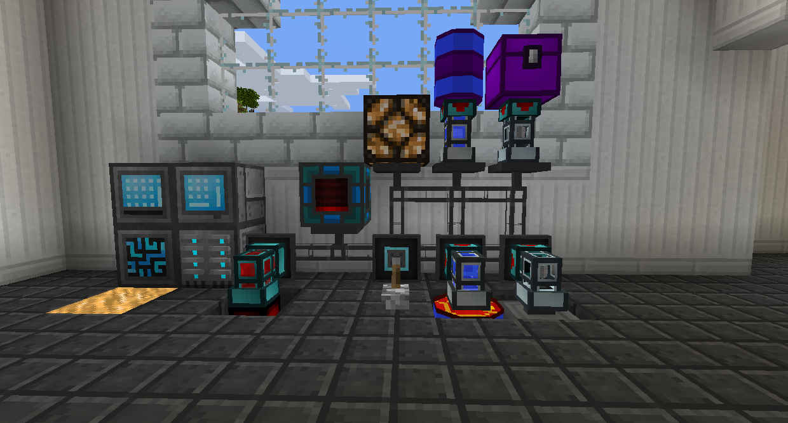

#Cables and Management

You can get away with using only a Grid and a Disk Drive, but you'll be missing out on what makes digital storage great.

Cables are used to connect devices to the Controller. Grids and other Refined Storage blocks can work if they are touching the Controller directly (or are touching other RS blocks that are), but Cables allow you to connect things that are farther away.

Importers will pull items out of the inventory it is placed on and import them into the Refined Storage system. You can specify what to import by opening the Importer's GUI.

Exporters will push items out of the RS system into the inventory it is placed on. You can specify what to export by opening the Exporter's GUI.

External Storages allow you to see the contents of the inventory you place them on from inside the RS system.

If the External Storage has a higher priority than other storage blocks, like the Disk Drive, items will try to go into the inventory the External Storage is placed on before going into the Disks.

Destructors will break whatever block it is facing and place it into the RS system. You can set a blacklist or a whitelist of what blocks to break in its GUI.

Constructors will place a specified block into the world from the RS system.

Readers and Writers go together to allow you to transfer energy, Redstone signals, fluids, and items without using Importers and Exporters. Place the Reader where you want to get things to come from, and place Writers where you want them to go. Open their menus and select the channel you want them to connect to. If the channel already exists, just click it. If the channel doesn't exist yet, type the name you want to give it and hit enter to create the channel.
Writers will not push the item or fluid into the block it is facing, you will have to pull from it with either a Hopper or any other method of automation.

Relays work like Cables but turn off when given a Redstone signal.

Interfaces allow you to automatically import and export from a single block.
Any items piped into it will automatically enter the system.
Place an item and specify the amount in the Interface Export slots, and the Interface will try to keep that amount of that item in the bottom row, which can be piped out.