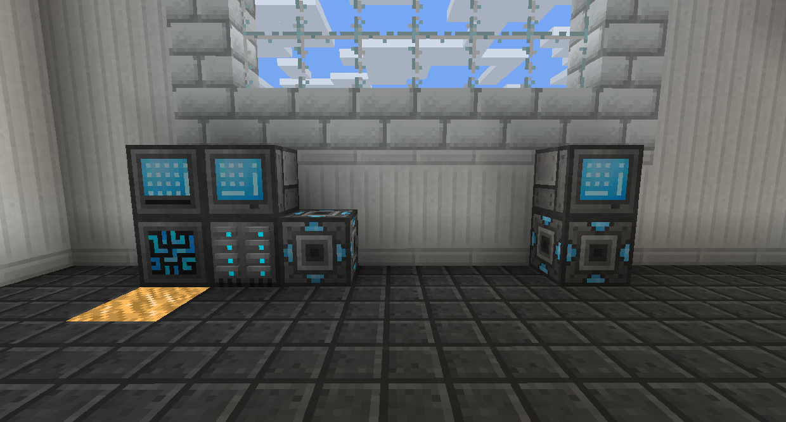
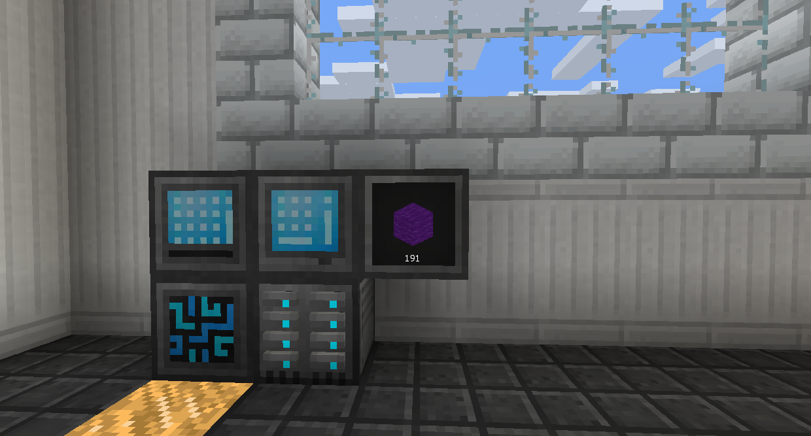

#Other

The Network Transmitter, Receiver, and Card all work together to allow you to wirelessly connect Grids and other blocks over distances.

Place the Network Tranmitter at your base, connected to the Controller.
Place the Network Receiver somewhere else, and sneak right click the Network Card on it to set it to that Receiver.
Place the Network Card into the Transmitter, and it will connect to the Receiver.

The Network Transmitter works across dimensions.

The Storage Monitor acts basically like a Storage Drawer, but connected to your RS system. Sneak right click it with an empty hand to open its menu, where you can set what block you want to display. Then, you can punch it to pull a single item out, sneak punch to pull a stack, or right click to insert items.

The Portable Grid works a bit like a digital backpack. Place a Disk of any kind in the top right slot, and you will be able to access its contents while it has power.

The Wireless Transmitter allows you to access the RS system within 16 blocks of itself using Wireless Grids of any type.
To set the Wireless Grid to the RS system, sneak right click it on the Controller.

The Detector will emit a Redstone signal according to how its set. You can set it to emit when it has over, under, or exactly a specific amount of a specific item or fluid. This is useful if you want to keep a backlog of a specific thing that has to be crafted, but don't want it running all the time.

Upgrades can do various things to different machines.

The Range Upgrade will increase the range of a Wireless Transmitter by 8 per Upgrade.

The Speed Upgrade will increase the speed of the device it is inserted into, like Crafters.

The Crafting Upgrade will make Interfaces and Exporters try to craft the item it is exporting if there are none available.

The Stack Upgrade will make Importers and Exporters pull and push at a stack at a time.

Silk Touch and Fortune Upgrades can be installed on Destroyers to make it apply that enchantment when breaking blocks.