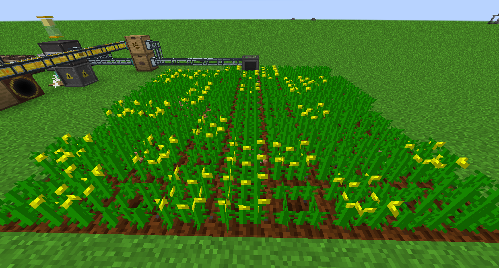
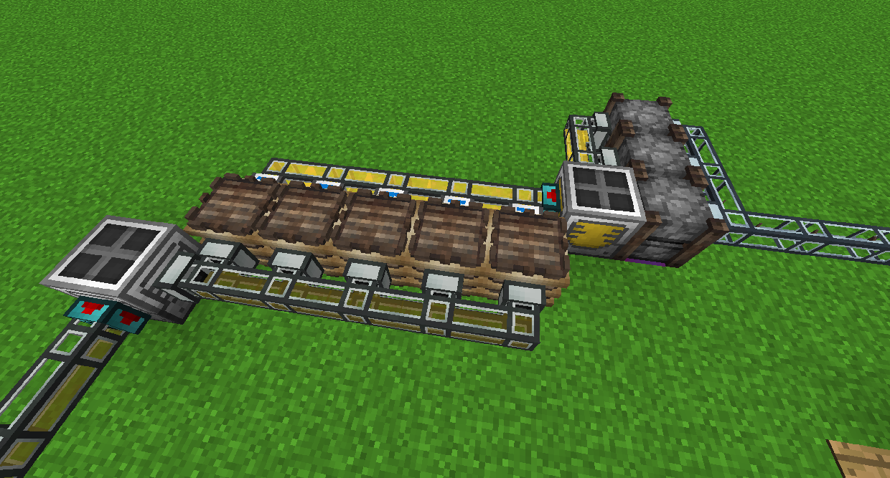
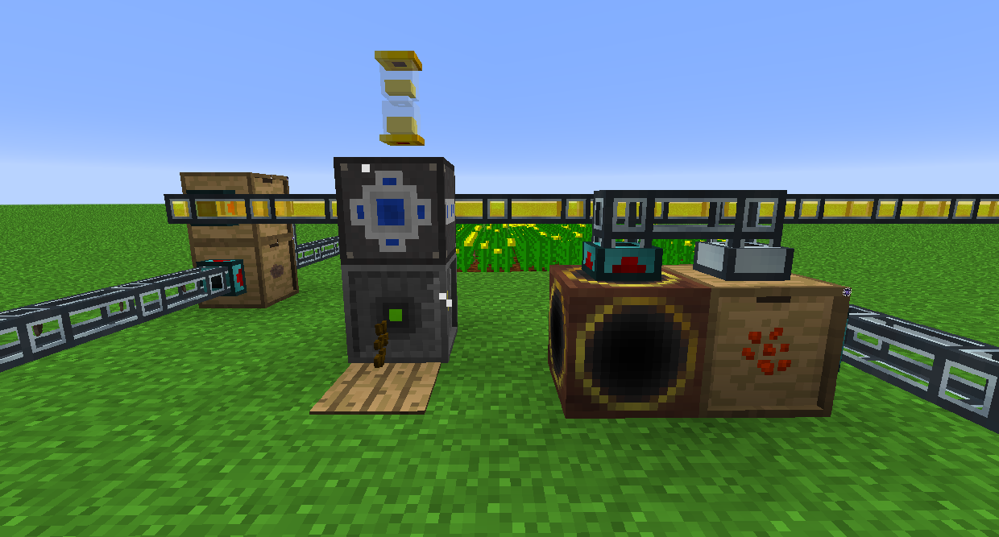
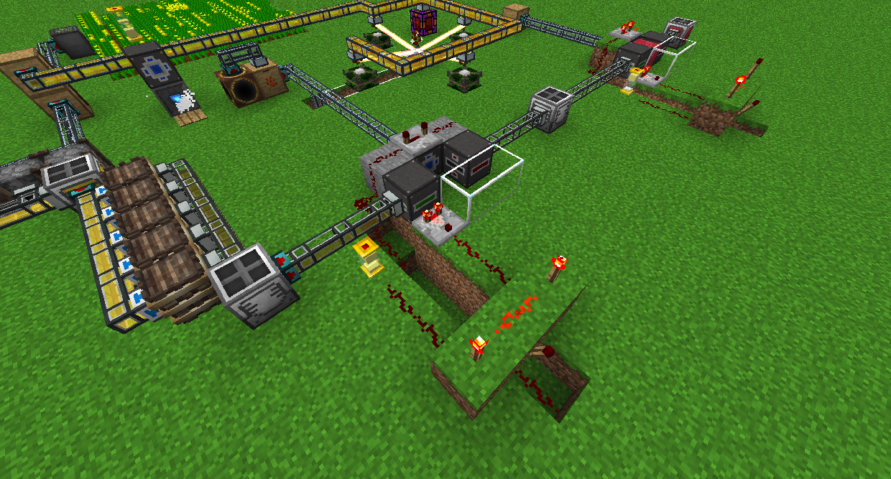
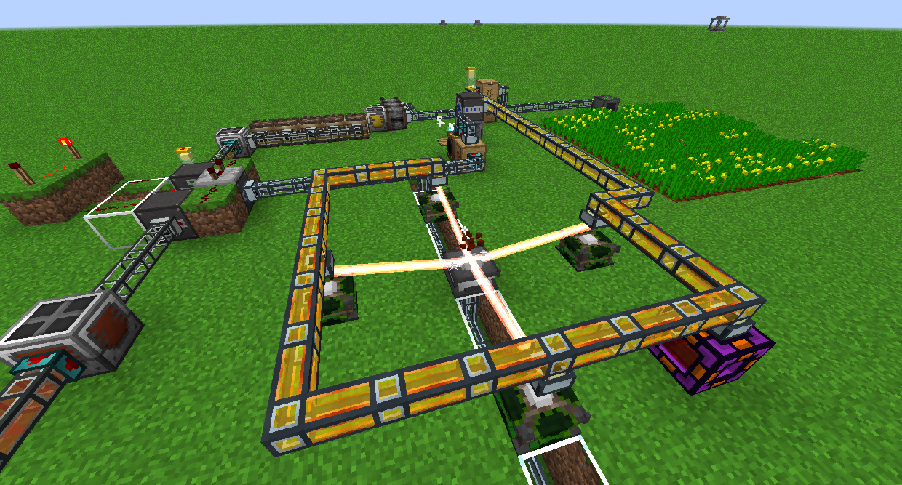
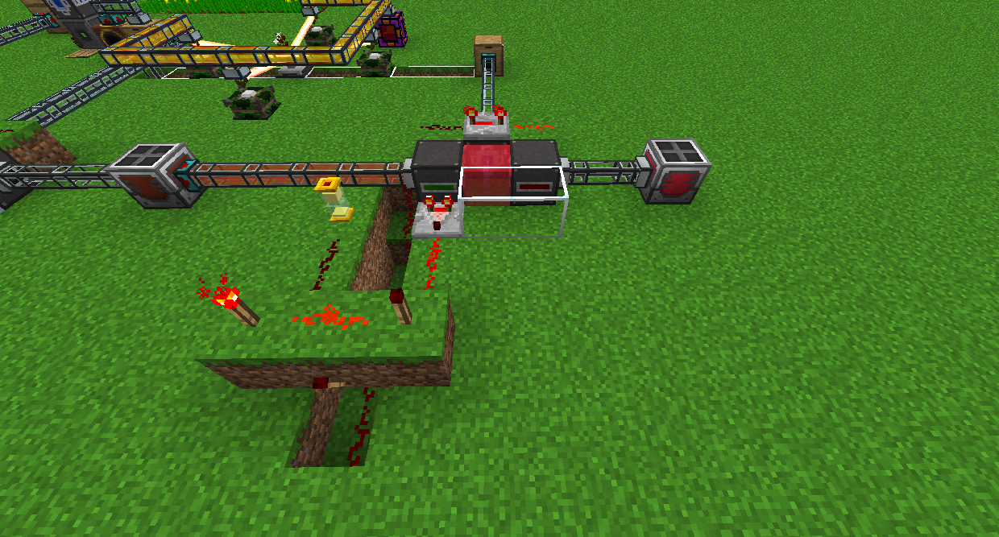

# Canola Oil

First things first, you'll want to farm some Canola. You can use any farming blocks you want.

Next, put the Canola into a Canola Press to make Canola Oil. Canola Oil generates 80,000 RF at 40 RF/t, or you can continue processing the Oil to make it better.

Move the Canola Oil into a Fermenting Barrel (you can just put the Fermenting Barrel directly next to the Canola Press) and it will turn into Refined Canola Oil, which generates 192,000 RF at 80 RF/t.

Next, make some Crystallized Canola Seeds by putting regular Canola Seeds in front of an Atomic Reconstructor.

Drop this in a pool of Refined Canola Oil. In the picture, a Comparator is being used to check if the Fluid Placer has at least 1,000mB of Refined Canola Oil in it. If it does, it powers 2 Redstone Dust which are connected to one half of a vanilla Redstone AND gate. The other half is powered by a Hovering Hourglass with 4 sand in it, for 4 seconds. If both are on, it powers the Fluid Placer and the Automatic Precision Dropper, pauses, then powers the Fluid Collector.

Crystallized Oil generates 560,000 RF at 100 RF/t.

For the last steps, put a Crystallized Canola Seed on an Empowerer and surround it with 4 regular Canola Seeds. This will make an Empowered Canola Seed.

Drop this in a pool of Crystallized Canola Oil, the same way as the Refined Canola Oil.

Empowered Oil generates 960,000 RF at 120 RF/t.