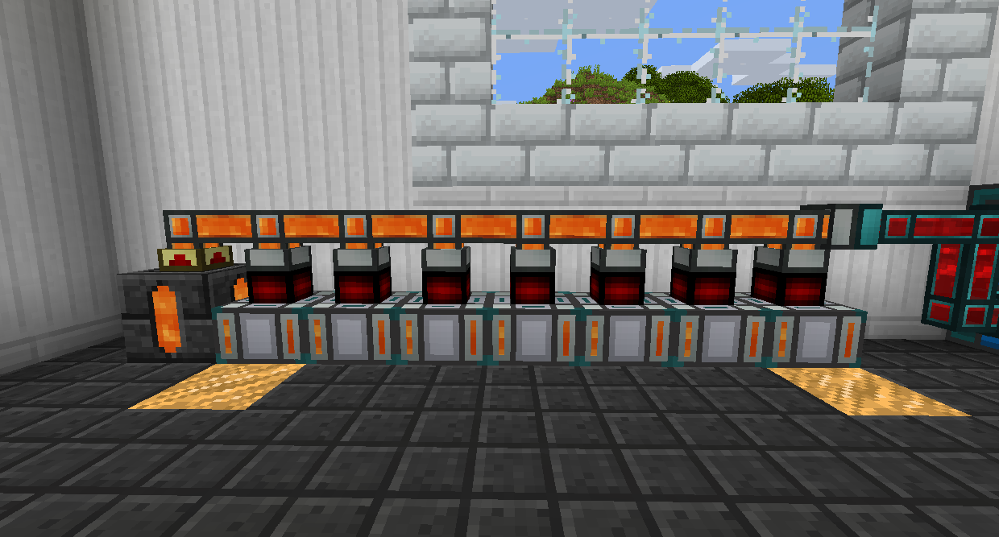
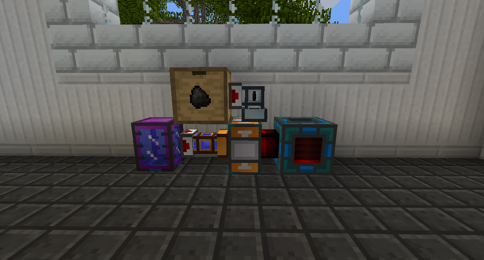
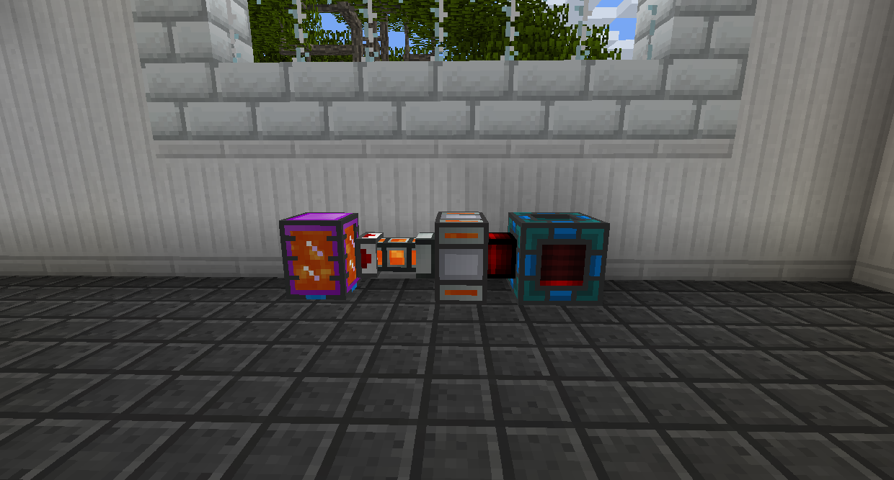
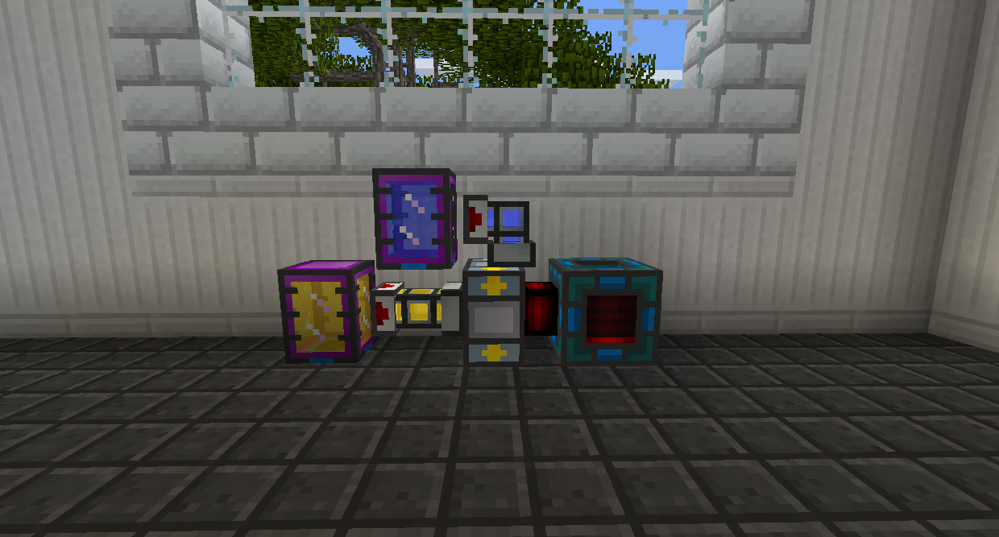
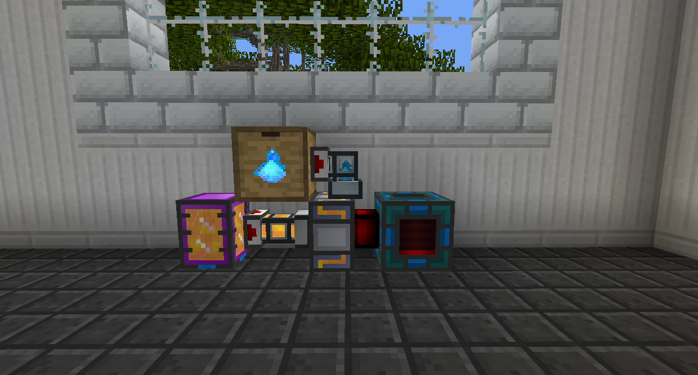
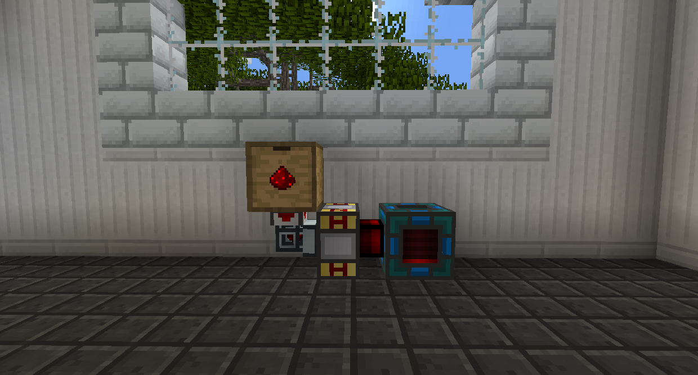
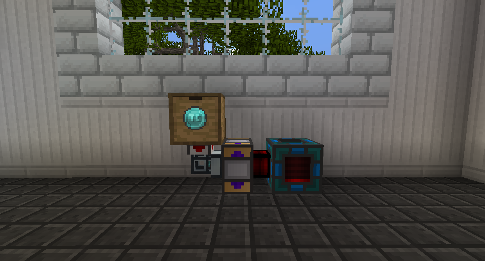

#Thermal Expansion Generators

All the generators added by Thermal Expansion are called Dynamos. You can pipe items and/or fluids into them from any side except the coil (the thin bit) unless you have an Augment: Transmission Coil Ducting installed on the Dynamo, and RF can be pulled out from the coil.

Dynamos, like most other Thermal Expansion machines, come in tiers. Higher tiers generate RF faster. They don't make MORE RF, they just take less time to make the same amount. To increase the tier of a Dynamo, right click it with an Upgrade Kit of the next tier, or a Conversion Kit of the tier you want to jump to. The tiers in order are as follows:
•Basic
•Hardened
•Reinforced
•Signalum
•Resonant

Dynamos will constantly generate RF if they have fuel, even if they don't have anywhere to put it. You can install the Augment: Excitation Field Limiter to make them stop working when full to prevent fuel from being wasted.

The names of the Dynamos below are links to their respective wiki page.

[Steam Dynamo](https://teamcofh.com/docs/thermal-expansion/steam-dynamo/)
Generates RF using solid fuel and water.

[Magmatic Dynamo](https://teamcofh.com/docs/thermal-expansion/magmatic-dynamo/)
Generates RF using hot fluids.

[Compression Dynamo](https://teamcofh.com/docs/thermal-expansion/compression-dynamo/)
Generates RF using fluid fuel and coolant.

[Reactant Dynamo](https://teamcofh.com/docs/thermal-expansion/reactant-dynamo/)
Generates RF using fluid fuel and a solid reactant.

[Enervation Dynamo](https://teamcofh.com/docs/thermal-expansion/enervation-dynamo/)
Generates RF using Redstone or discharging items.

[Numismatic Dynamo](https://teamcofh.com/docs/thermal-expansion/numismatic-dynamo/)
Generates RF using currency.
