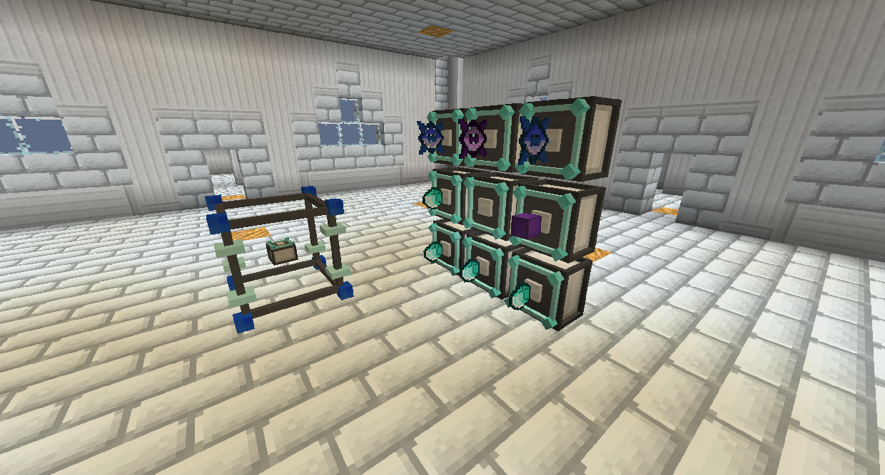
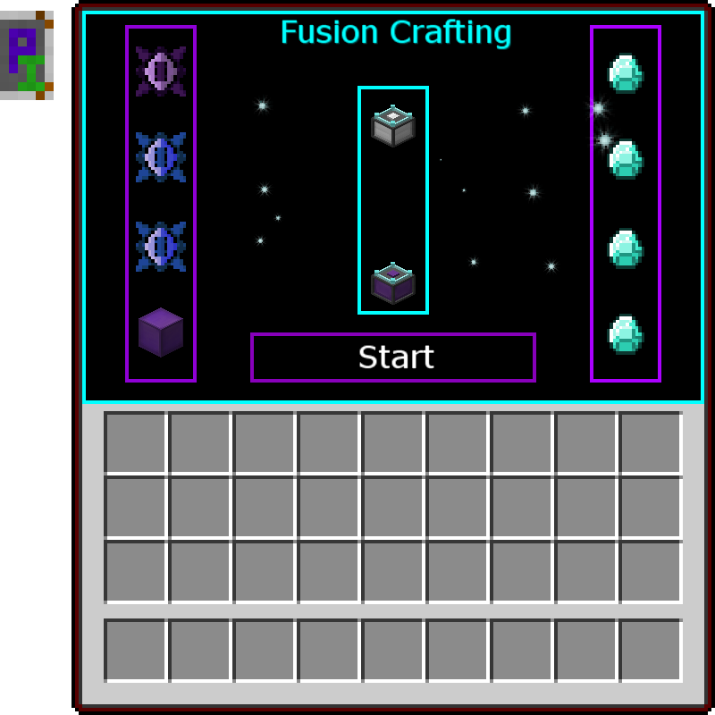
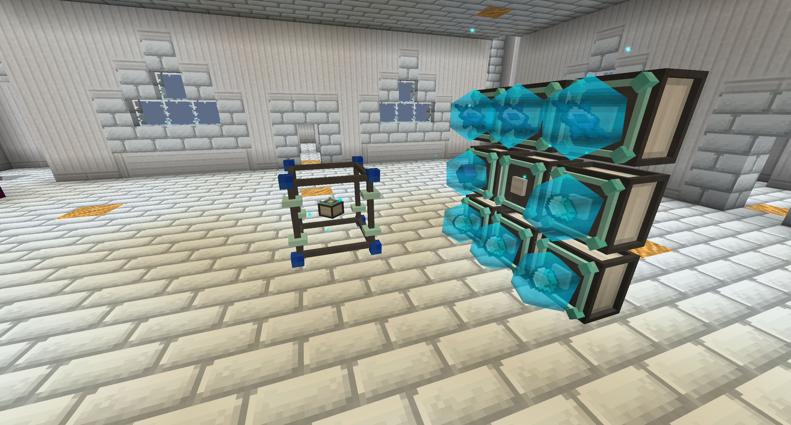
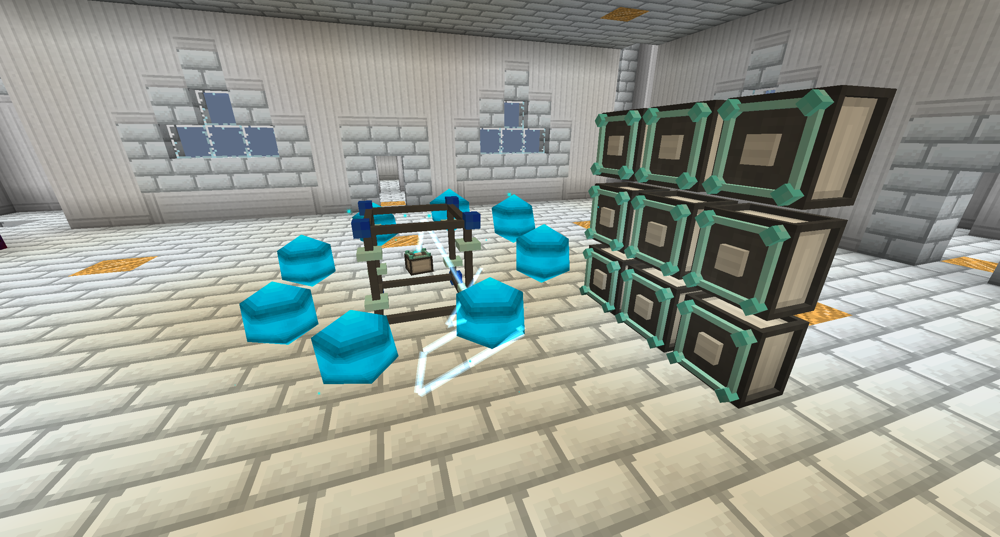

# Fusion Crafting

Fusion Crafting uses a very large amount of energy to craft items together, combining them into something new.

Place the Fusion Crafting Core in the center of where you want the structure to be.

Place the Fusion Crafting Injectors in any direction from it as long as it's within a 3x3 area with the center being aligned with the Fusion Crafting Core.

There are multiple tiers of Fusion Crafting Injectors. Higher tiers have access to more recipes they can use.

The main crafting ingredient goes in the Fusion Crafting Core, and then one of each secondary ingredient goes in the Fusion Crafting Injectors. The order and location does not matter.

Once all the items are in the correct locations, open the Fusion Crafting Core and click "Start." The Fusion Crafting Injectors will begin to fill up with energy provided, and then once fully charged they will megin to fuse with the main ingredient.

