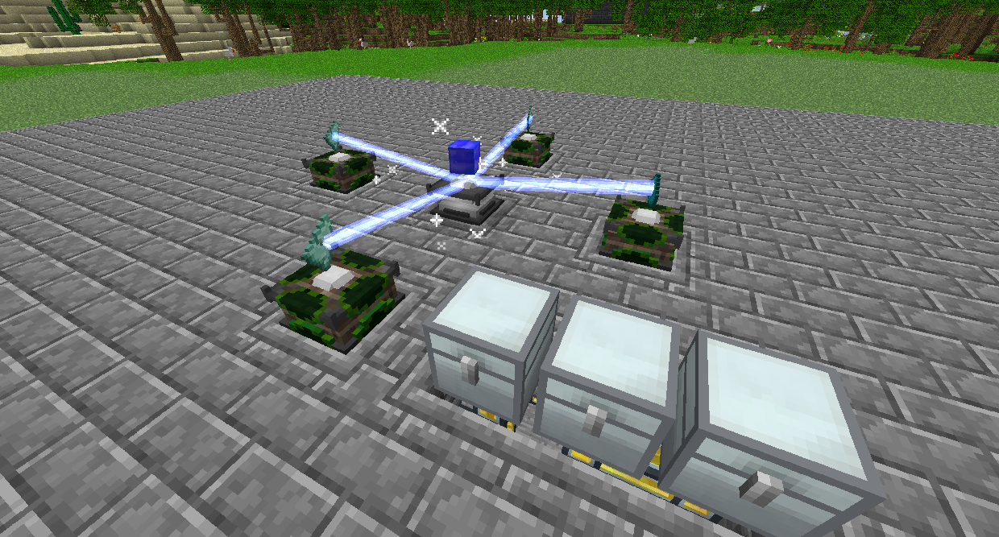

# Empowerer

The Empowerer is a multiblock machine that is used to enhance certain items, usually Crystals.

Place the Empowerer down, and then place a Display Stand in each direction with 2 blocks between it and the Empowerer.
Provide power to the Display Stands, and put the items in according to the recipe, and it will begin to craft.

