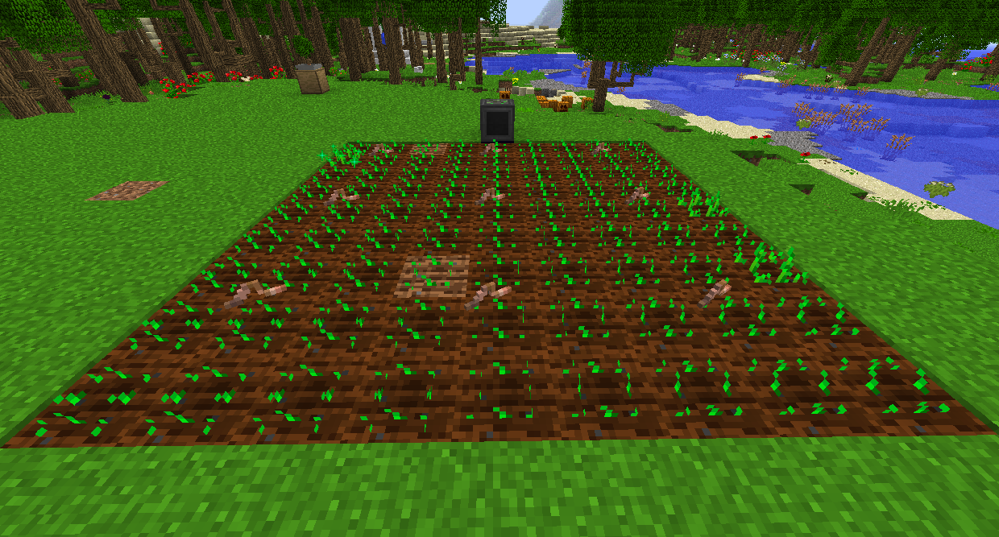
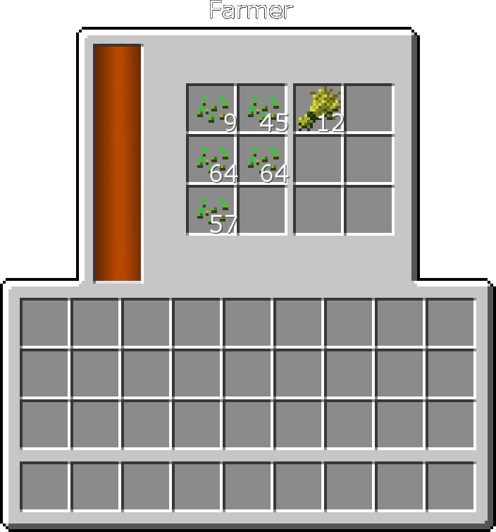

# Actually Additions

The Farmer can automatically plant and harvest crops in a 9x9 area in front of it.

Harvested seeds will automatically go in the left slots, and the crops themselves will go on the right slots.