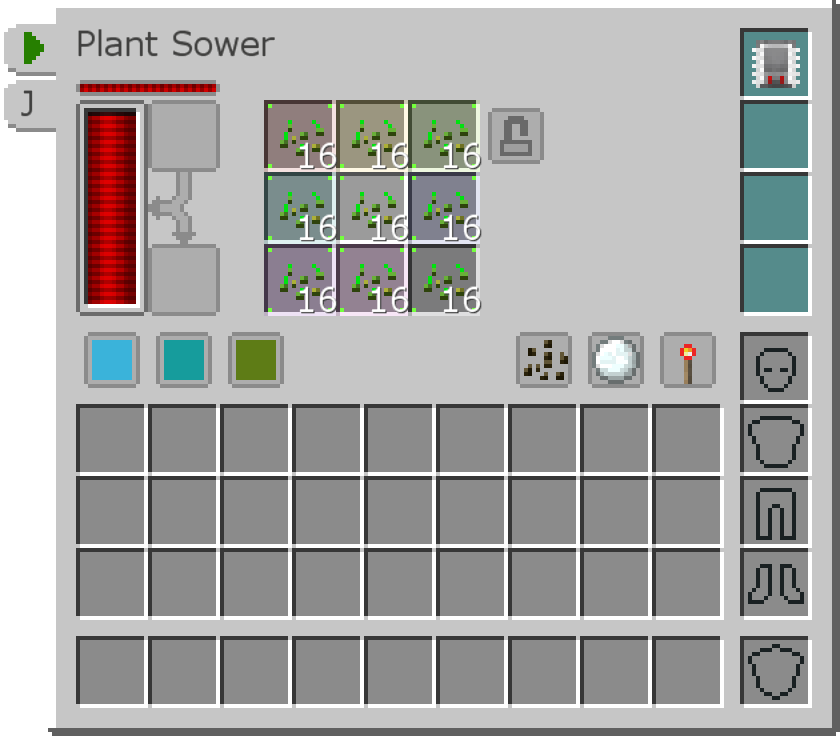
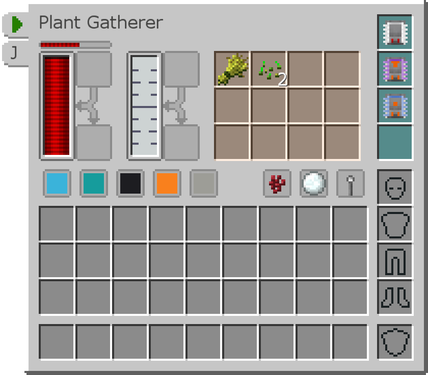
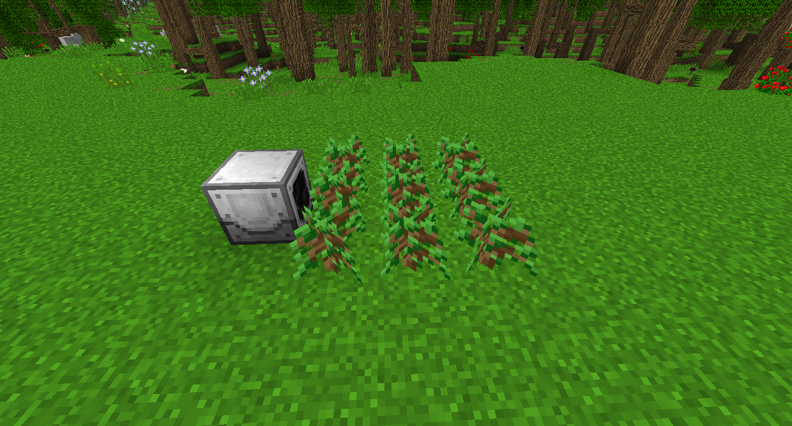

# Industrial Foregoing

You can use a combination of the Plant Sower (which plants seeds) and the Plant Gatherer (which harvests crops) to farm most plants.

Place the Crop Sower underneath the center of the growing area. It has a default range of 1 block, so to increase it to working in a 9x9 area you will have to use a Range +4 Addon.

Insert seeds into the slots. Seeds will only be planted in the field in the corresponding slots in the Sower. That is, if there are only seeds in the top three slots, only the Northern third of the working area will have seeds.

Face the Plant Gatherer at the field. Again, it needs a Range +4 Addon to work in a 9x9 area. It will scan the working area (you can click the Snowball to show it in the world) for fully grown crops and break them, inserting its drops into its internal inventory. It will also produce a small amount of Sludge.

In the example above, an Itemstack Transfer Addon is used to automatically move the Seeds and Wheat into an adjacent Storage Drawer. Itemducts move the Seeds back to the Plant Sower. A Fluid Transfer Addon is also used to automatically move the Sludge into the Black Hole Tank above.

