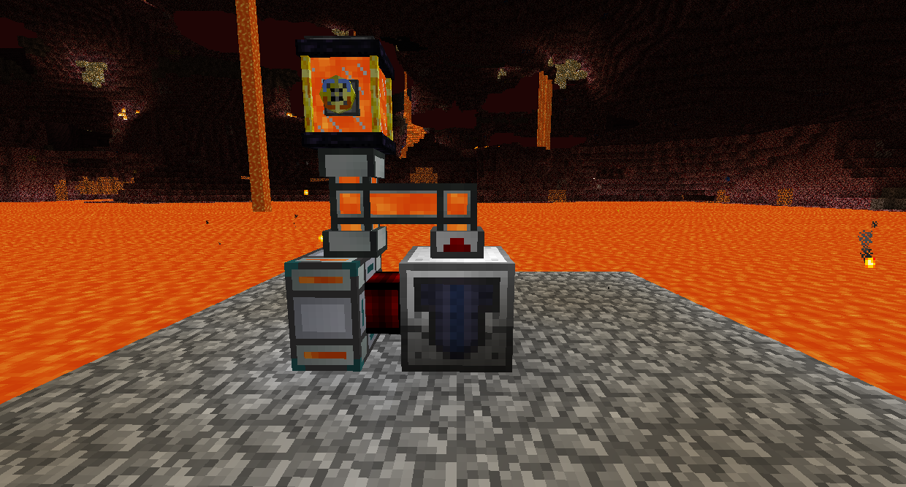
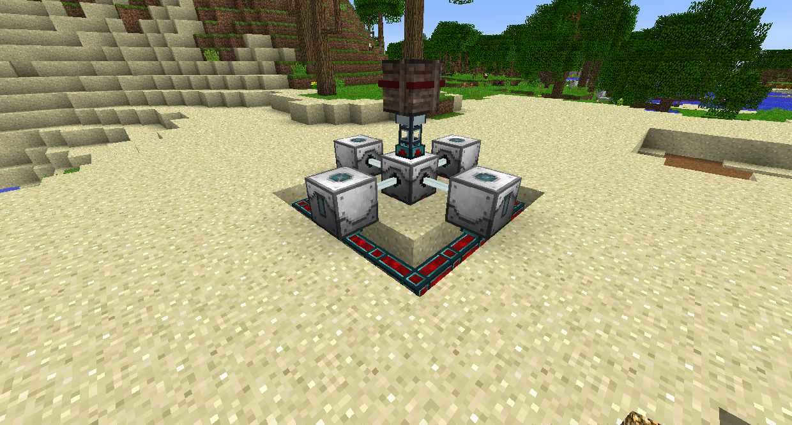
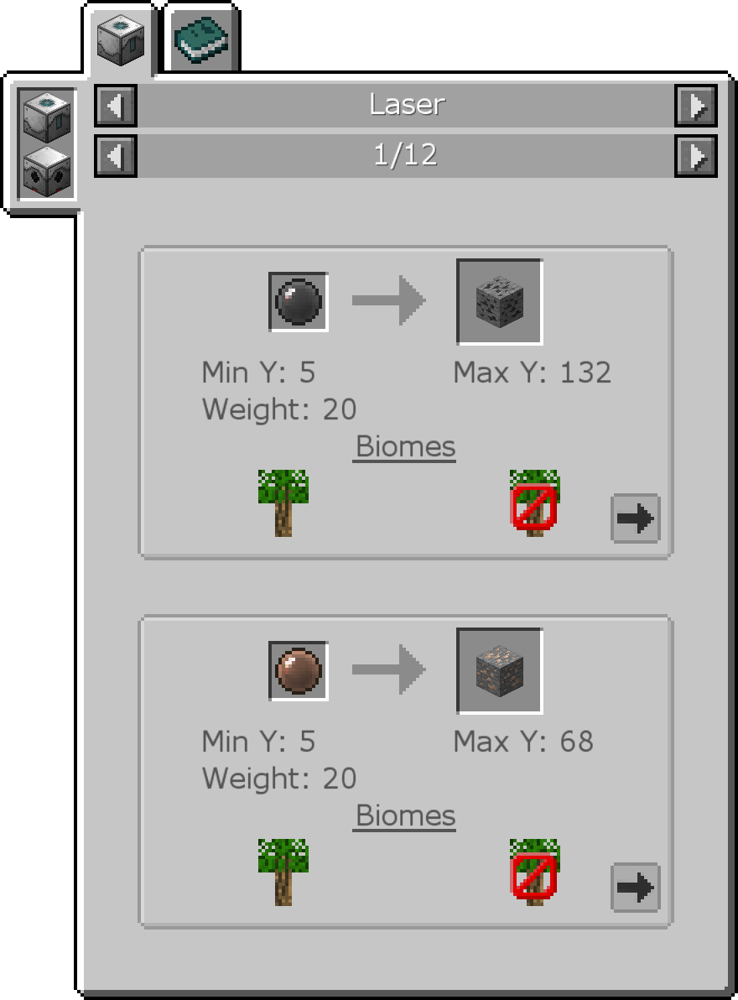
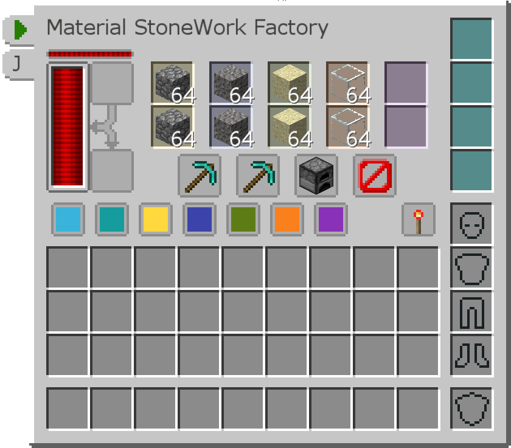

# Ore and Fluid Gathering

The Fluid Pump will check the fluid directly underneath it and then pump all of that fluid in the working area into its internal tank, where it can be piped out. Pumped fluids will be replaced with Cobblestone.

Its default working area is only 1x1, so you need to insert Range Addons before powering it to make it work in that area.

The Laser Base and Laser Drills work together to generate ores from energy alone. Place down the Laser Base any then surround it with 4 Laser Drills that are facing it with one block between them. Provide power to the Laser Drills and it will begin to generate ores.

The Laser Base generates ores depending on the depth you set it to. Open its GUI and you can change the depth it is set to mine in by pressing the - and + buttons. You can also insert Laser Lenses into the 6 slots on the left to increase the chance of mining the ores associated with that color. Hit U while hovering over the Laser Base in your inventory to see the optimal depths and Laser Lenses for each ore.

The Material Stonework Factory will use RF to generate Cobblestone. It can also automatically turn the Cobblestone into other blocks that you can make from Cobblestone by clicking the buttons between column. For instance, you can make it generate Glass by first grinding the Cobblestone into Gravel, then grinding again into Sand, then smelting into Glass, without ever leaving the block!

