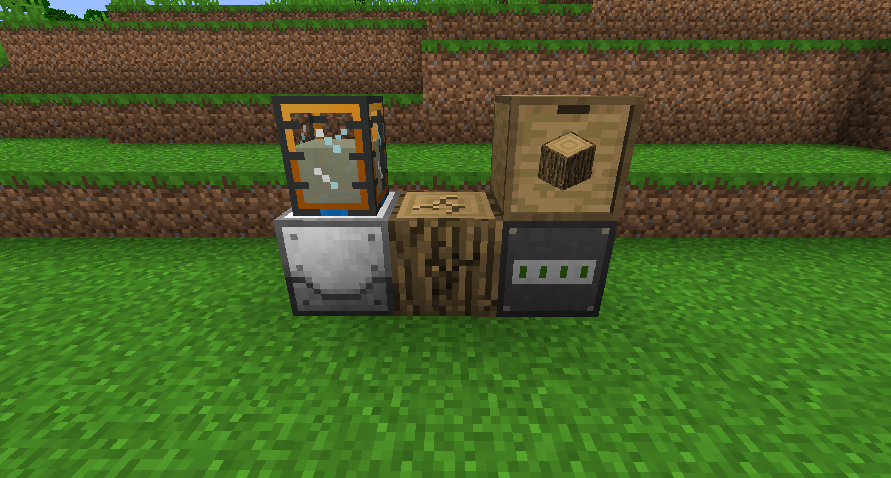
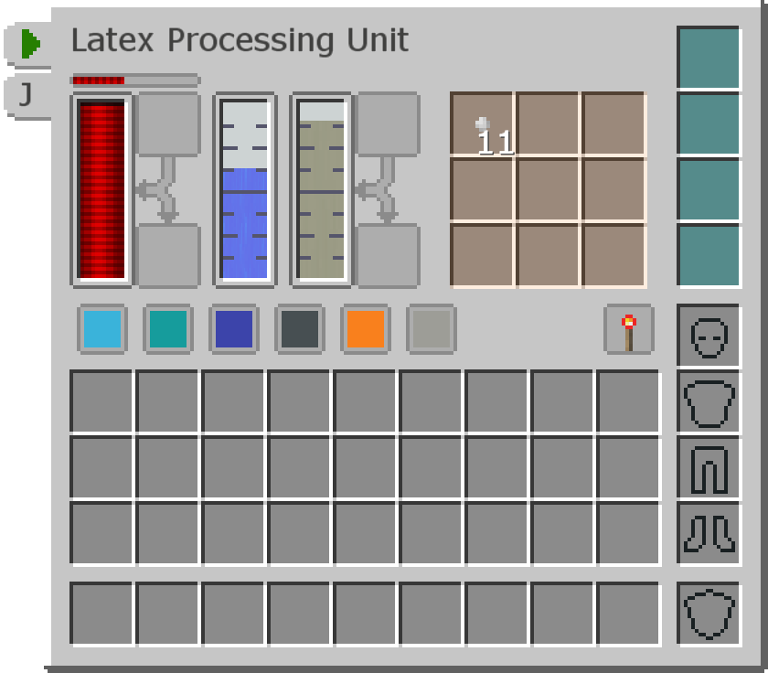

# Plastic

Almost every machine in the mod Industrial Foregoing requires Plastic in their crafting recipe. This page will teach you how to get it.

The Tree Fluid Extractor will slowly break the Log it is facing, slowly generating liquid Latex in its internal tank.
The Log will eventually break, so if you want to fully automate it you should use an Auto-Placer full of Logs.

The Latex Processing Unit will combine 75mB of liquid Latex and 1000mB of Water to create 1 Tiny Dry Rubber. Craft 9 of those together to get Dry Rubber, which can be smelted to create Plastic.
