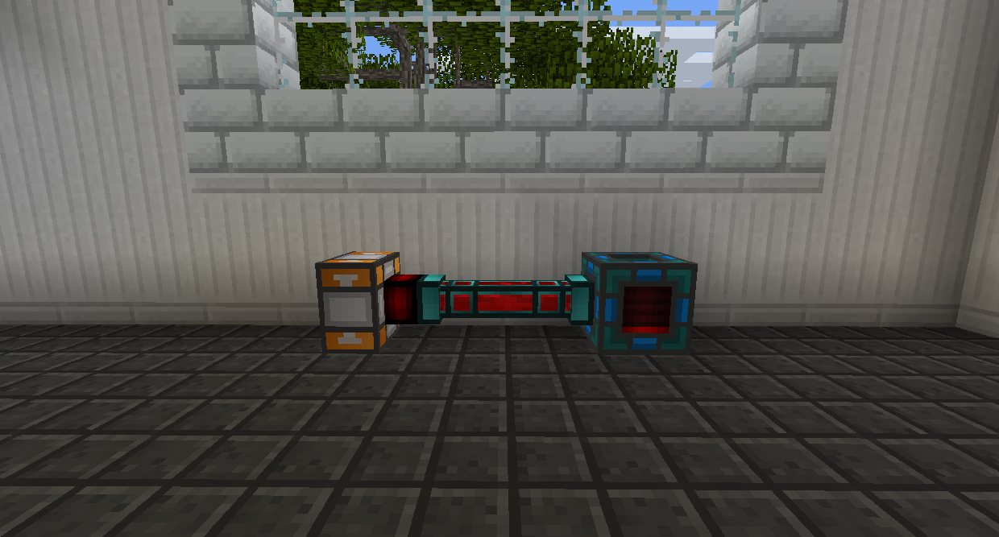

# Fluxducts

Fluxducts are used to transfer energy.

Place a line of Fluxducts along the path you want it to move, starting at the source and ending at the destination. You can have multiple sources and destinations per line. You can use the Crescent Hammer to sever unwanted connections. 

Fluxducts can only carry a certain amount of RF over a given time frame. This is measured in RF/t, RF per tick. A tick is the rate the game runs at, with 20 ticks per second without lag.

Leadstone Fluxducts are the most basic; they can only transfer 1,000 RF/t per connection. Each Leadstone Fluxduct also can store 5,000 RF.

Hardened Fluxducts can transfer 4,000 RF/t per connection. Each Hardened Fluxduct also can store 20,000 RF.

Redstone Energy Fluxducts can transfer 9,000 RF/t per connection. Each Redstone Energy Fluxduct also can store 45,000 RF.

Signalum Fluxducts transfer 16,000 RF/t per connection. Each Signalum Fluxduct also can store 80,000 RF.

Resonant Fluxducts transfer 25,000 RF/t per connection. Each Resonant Fluxduct also can store 125,000 RF.

Cryo-Stabilized Fluxducts transfer an infinite amount of RF/t, limited only by the pushing power of the source. They do not have any internal RF storage.

The Crescent Hammer acts as a wrench. It can rotate most blocks, sever Duct connections, and instantly break Ducts if sneak right clicked.
