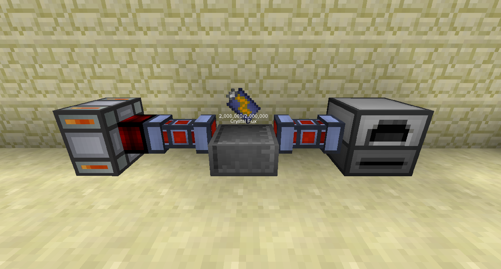
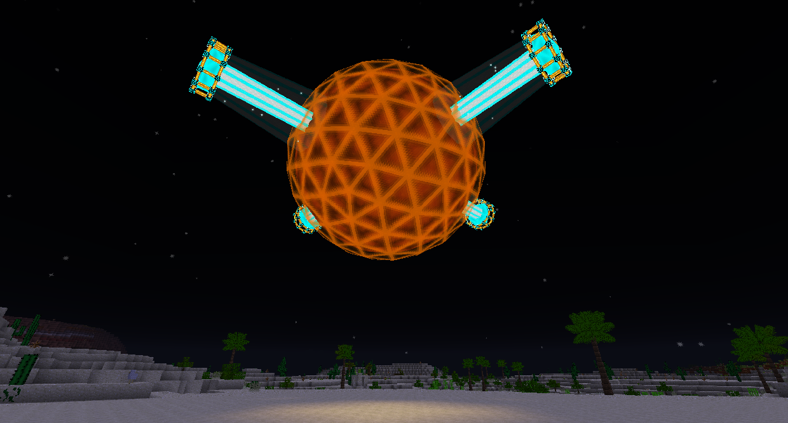

# Energy Storage

It isn't good enough to simply generate and use power. Storing it is very important as well, in case you occaisonally have to use more RF than is being made. There are several ways to store RF in this modpack.

Energy Cells can be set to input and output from specific sides. You can upgrade it with Upgrade Kits to store more. The Basic Energy Cell can store 2,000,000 RF, and the max tier can store 50,000,000 RF.

Battery Boxes can charge and discharge whatever Battery is in them. You can put a Battery in and out just by right clicking it on the Battery Box.

The Energy Storage Core is a multiblock structure that stores a massive amount of RF. The first tier stores 45,500,000 RF, and the max tier can store 9,223,000,000,000,000,000,000 RF.

Energy Storage Cores require a bit more work to set up than Energy Cells and Battery Boxes. Place the Energy Storage Core block at the center of where you want the multiblock to be, and then place 4 Energy Core Stabilizers around it on the same y-level. Open the Energy Storage Core's GUI and you can choose its tier, and you can toggle the Build Guide on and off. When everything is set up, click Activate.

To move RF in and out of the Energy Storage Core, place an Energy Pylon within 16 blocks of the Core and place a block of Glass either above or below it, depending on if the Pylon is below or above the Core. Connect power to these. To toggle between input and output, right click on the sphere.
