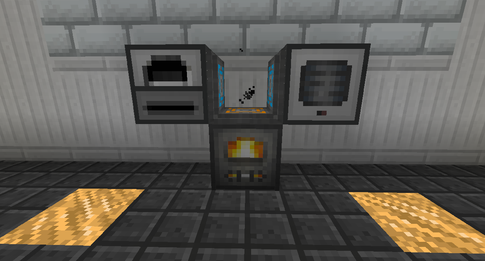

# Energy Tesslocators

Energy Tesslocators come in two tiers: Basic and Advanced.

Basic Energy Tesslocators allow you to move energy over extremely short distances. They also store a small amount.

Basic Energy Tesslocators can store 32,000 RF, and extract energy at 2,048 RF/t.

You can have more than two Tesslocators in a single block space. Energy will try to split equally.

Place Tesslocators in the same block space on each block you want to interact with. Right click to swap between input and output modes.

Advanced Energy Tesslocators allow you to move energy wirelessly over any distance.

Advanced Energy Tesslocators can store and extract energy at 4,000,000 RF/t.

To connect Advanced Energy Tesslocators together (since they aren't in the same block space anymore), hold two dyes in both hands and right click the Tesslocator.

To toggle between input and output mode, sneak right click the Tesslocator with an empty hand.
