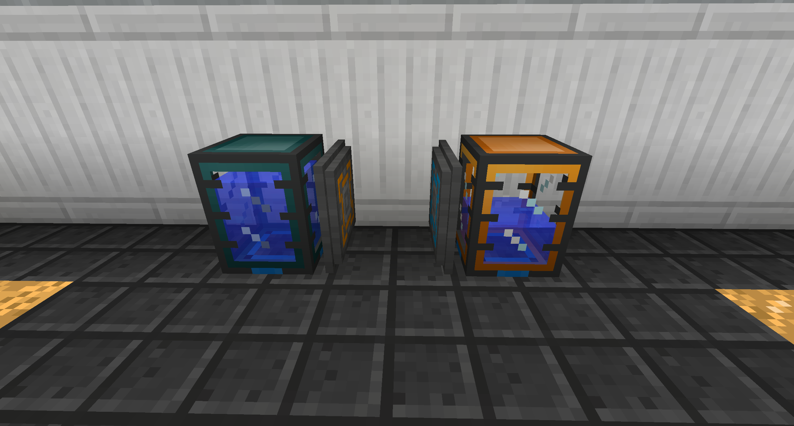
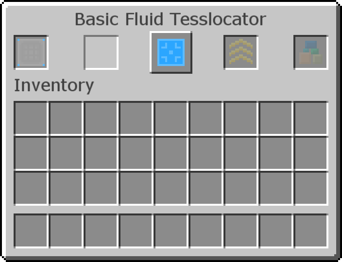

# Fluid Tesslocators

Fluid Tesslocators allow you to quickly move fluids over extremely short distances.

Fluid Tesslocators will move 8,000 mB every 0.8 seconds.

Place Fluid Tesslocators in the same block space on each block you want to interact with. Open its GUI to change its settings.

The center button allows you to change between input, output, and input/output modes. Fluids will move from output-mode blocks to input-mode blocks.

The left slots are filters you can set by inserting filled Buckets or Item Filters to whitelist what fluids can come in or out.

You can insert Glowstone into the first slot on the right to make it work more often, up to 8 to make it work once per tick.

You can insert Diamonds into the second slot on the right to make it move more fluid at once, up to 3 to make it send 32,000 mB at a time.
