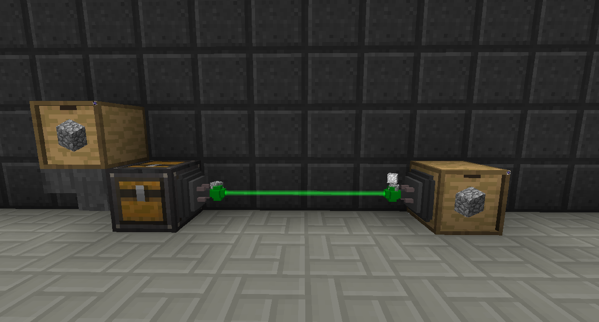
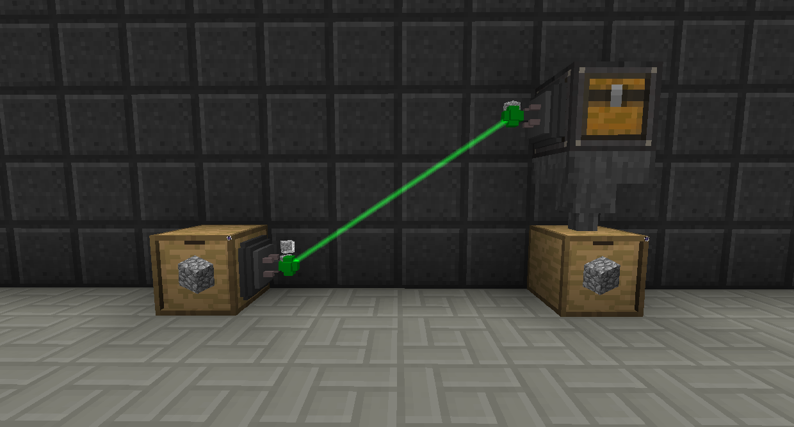
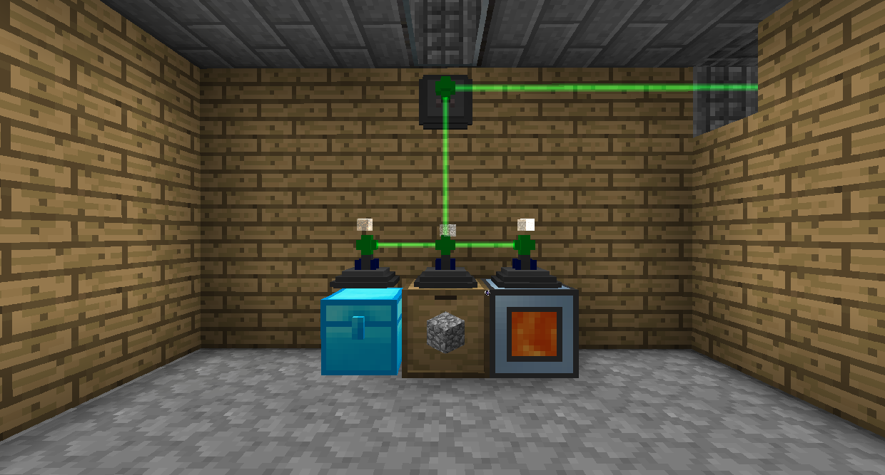
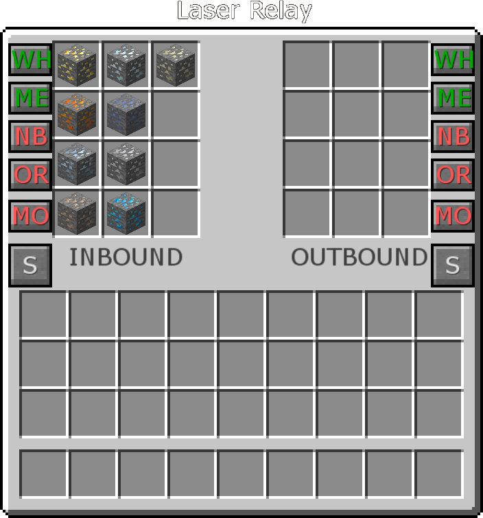

# Item Laser Relays

Item Laser Relays are wireless and can transfer items as quickly as you can provide them.

To connect Laser Relays, right click on both of them with a Laser Wrench.

Items can only interact with the storage network through Item Interfaces. Place Item Laser Relays on the blocks that you want to store the items and then place an Item Interface where you want to interact with the network (say, where you want to insert items). Place another Item Laser Relay on the Item Interface, and connect them all with the Laser Wrench.

Item Laser Relays have a priority system. Items will try try to go to the inventory of the **highest** priorty first, and if it can't go into that one it will go to the inventory of the next highest. If there are multiple inventories with the same priority, items will go into the nearest one.

There are also Advanced Item Laser Relays that can have whitelists/blacklists. Right click one to open its GUI. There you can set what is allowed to enter the inventory it's placed on with the slots on the left, and you can set what is allowed to exit with the slots on the right. You can click the S block to quickly set the list to whatever's currently in the inventory.
