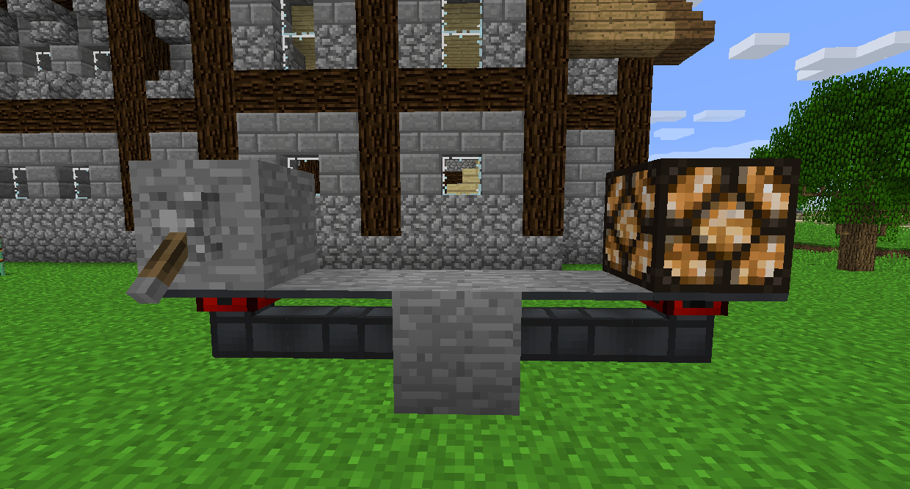

#Structuralducts

Structuralducts don't transfer anything, but connect to all other Ducts (aside from Cryo-Stabilized Fluxducts and Viaducts).

They are very useful for Redstone Inlays, which allow you to transfer Redstone signals through a Duct network. Since Structuralducts connect to all kinds of Ducts, you can put one Redstone Inlay on an Itemduct and another on a Fluiduct for instance. You can also just put both on Structuralducts to have freestanding Redstone cables.

Covers are placed on Ducts to disguise that side as the block you used to craft the Cover. You can dismantle a Cover by clicking it with a Crescent Hammer.

