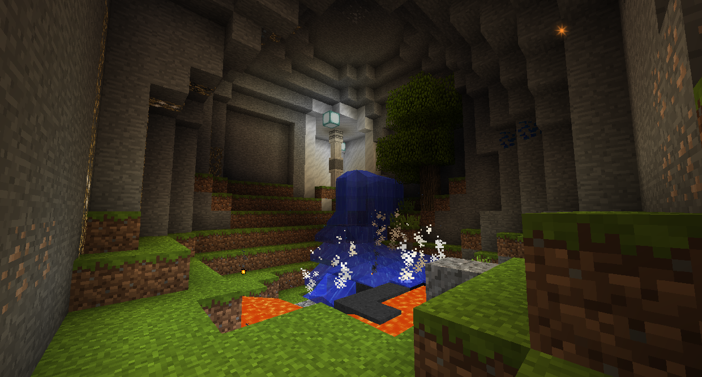

#The World
A modded Minecraft world generates a lot differently than a vanilla, unmodded one. There are new biomes, new structures, new plants, animals, and ores, and new dimensions, depending on the mods installed. We'll only be covering the mods in this modpack, though.

