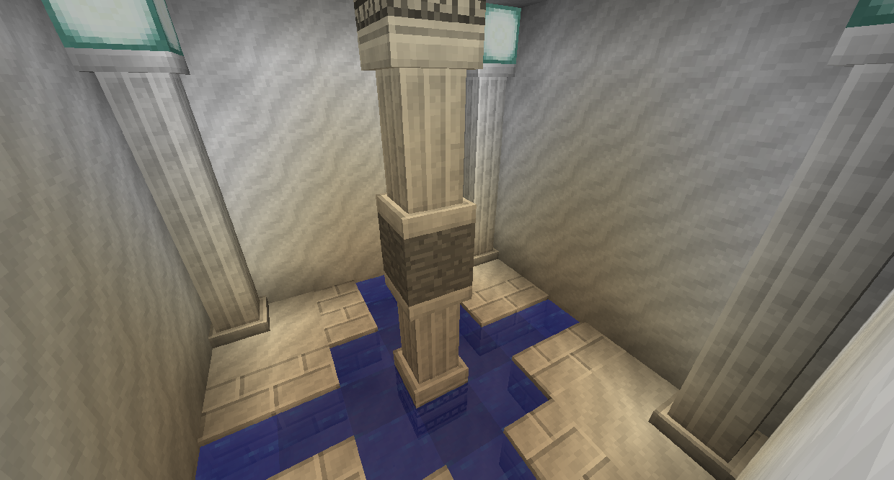

# Structures

A lot of mods add structures that you can find around the world.

### Floating Islands
Tinkers' Construct adds slime islands that can be found floating in the sky. Blue slime mobs spawn on these, and killing them drops blue Slime Balls. There are three different kinds of floating Slime Island: Purple, Blue, and Green. Purple are the most rare, and you can harvest the Congealed Purple Slime Blocks on them for purple Slime Balls, which are used to make Knightslime (a material for Tinkers' Construct tools). You can also chop down the slime trees which will give you Slime Saplings, which act as an infinite source of Slime.

### Shrines
Astral Sorcery adds three structures: Ancient Shrines, Small Shrines, and Treasure Shrines.
Ancient Shrines spawn high up, and are where you will start Astral Sorcery, as they contain a Floating Crystal. Read the Astral Tome for more information.

Fountains can spawn in most places. Under one of the pillars you may find a Chest with loot, possibly including a Constellation Paper.

Treasure Shrines can spawn rarely underground. At the center you can find a block that, when mined, regenerates as a random ore. You can get a very large amount of ores this way, though it will eventually run out.

### Actually Additions
Actually Additions adds Lush Caves, which are basically just small forests underground.

### Additional Structures
The mod Rex's Additional Structures adds a bunch of other miscellaneous structures to the world. 

