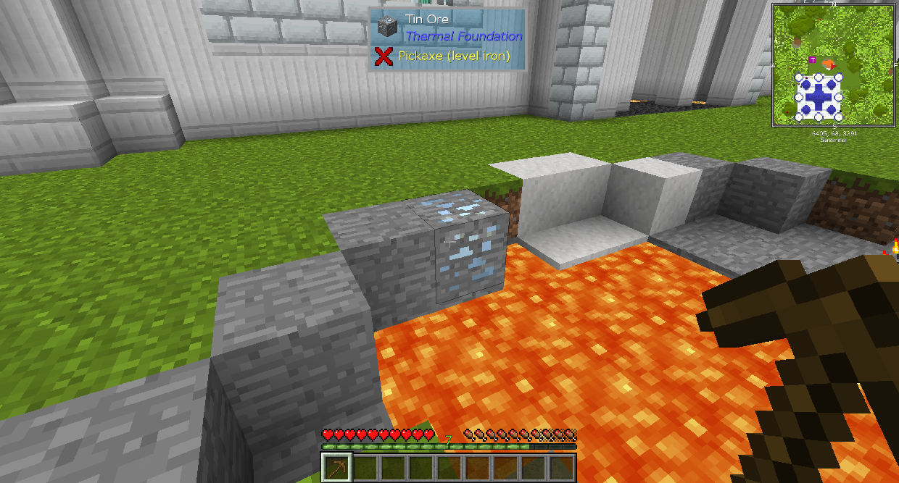
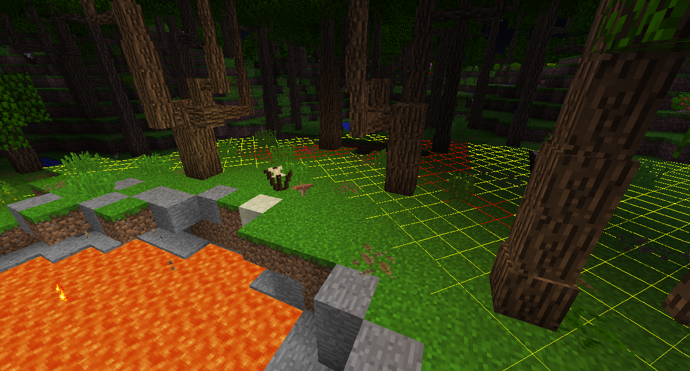
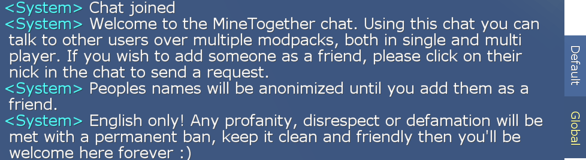

# Your Interface

Modded Minecraft naturally has a lot of differences from unmodded (vanilla). One of the first things you'll probably notice is changes to your inventory.

Different modpacks might have differences from each other, depending on the mods in them and the way they are configured. Most modpacks have these in common, though.

The item list on the right as well as everything highlighted in yellow is from Just Enough Items (JEI).
Everything in the top left corner is from FTB mods.
The minimap at the top right outside of your inventory is from JourneyMap.

The ring at the top right of the player portrait is from Baubles. Clicking it will allow you to insert baubles into the special slots. You can type "Bauble" into JEI to find all baubles.

The "..." button at the top right of the inventory opens the settings for Inventory Tweaks. You'll probably never need to open this.

Outside of your inventory, when you look at a block you can see at the top of the screen what that block is, as well as what mod adds it. This is added by the mod The One Probe.
It will also tell you what tool you need to break it, and what level of that tool you need. When it says "Pickaxe (level iron)" it does not mean it needs an Iron Pickaxe. It needs a Pickaxe that can mine Iron Ore.
It might also tell you other information about the block you're looking at, like what's in it and if it's doing something.

You can hit F7 to show what areas are dark enough for monsters to spawn. Blocks marked with a yellow X mean that a monster can spawn there at night, and a red X means that mobs can spawn any time.

Above mobs you can see their current health, their max health, and if they are armored.

In the chat menu, you can see an option for Global chat. This allows you to chat with everybody else that is playing the pack. When you open it, you have to accept it's EULA (which it has a link to), and then it will give you the rules if you accept.

To add players as friends, go to the pause menu and click the "Friends list" button at the top right. At the bottom left of the Friends list you can see your unique code. Share it with your friends and they will be able to add you to their friends list. This will allow you to chat with them, or join servers they are connected to. If you want to go back to only seeing your server's chat, click Default in the chat menu.
