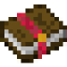

#FTB mods

Everything in the top left corner is added by FTB mods, like FTB Utilities, FTB Quests, and FTB Guides. Some buttons are only available when you are in a world with cheats enabled, or are OP on a server.

This button allows you to change settings for your team. That is, it lets you choose who is in your team, what other teams are allies, and what other teams are enemies.

This button allows you to change your client settings.

This button allows you to change server settings, if you are an admin or a single player world with cheats enabled.

This button opens the FTB Guides menu.

This button opens the FTB Quests menu.

This button toggles your gamemode if you have cheats enabled.

This button toggles rain if you have cheats enabled.

These buttons allow you to set the time to day or night if you have cheats enabled.

This button heals you if you have cheats enabled.

This button opens a map where you can claim chunks for your team. Left click to claim a chunk for your team, right click claimed chunks to unclaim them. Only members or allies of the team can interact with things in claimed chunks. You can hold shift and left click claimed chunks to make them permanently chunkloaded, so that chunk won't unload when nobody is nearby.

This button opens the Trash Can. You can put any items into it, and they will be destroyed forever if you leave them in and close the menu.
