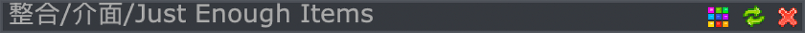
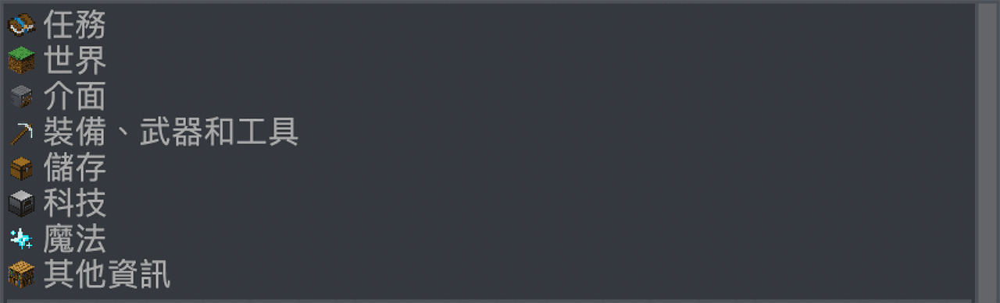

FTB Academy 是一個模組包，致力於教新玩家如何玩模組化的 Minecraft。我們將介紹所有重要概念和最流行的模組，以便您可以使用這些知識來玩更複雜的模組包。

如果你和其他人一起玩，你應該創建並加入一個團隊。這是通過單擊物品欄左上角的“我的團隊”按鈕來完成的。

在“指南”菜單的最頂部，您可以看到您所在頁面的目錄。您可以單擊之前頁面的名稱返回該頁面。您也可以按退格鍵返回上一頁。

您可以更改主題，刷新指南 (這僅對模組包製造者真正有用)，並使用右上角的按鈕關閉指南。您也可以按 E 或 Escape 關閉指南。

在上方，您可以看到可以訪問的頁面。單擊頁面名稱將其打開。

可以將鼠標懸停在某些圖像上以查看額外的說明。

